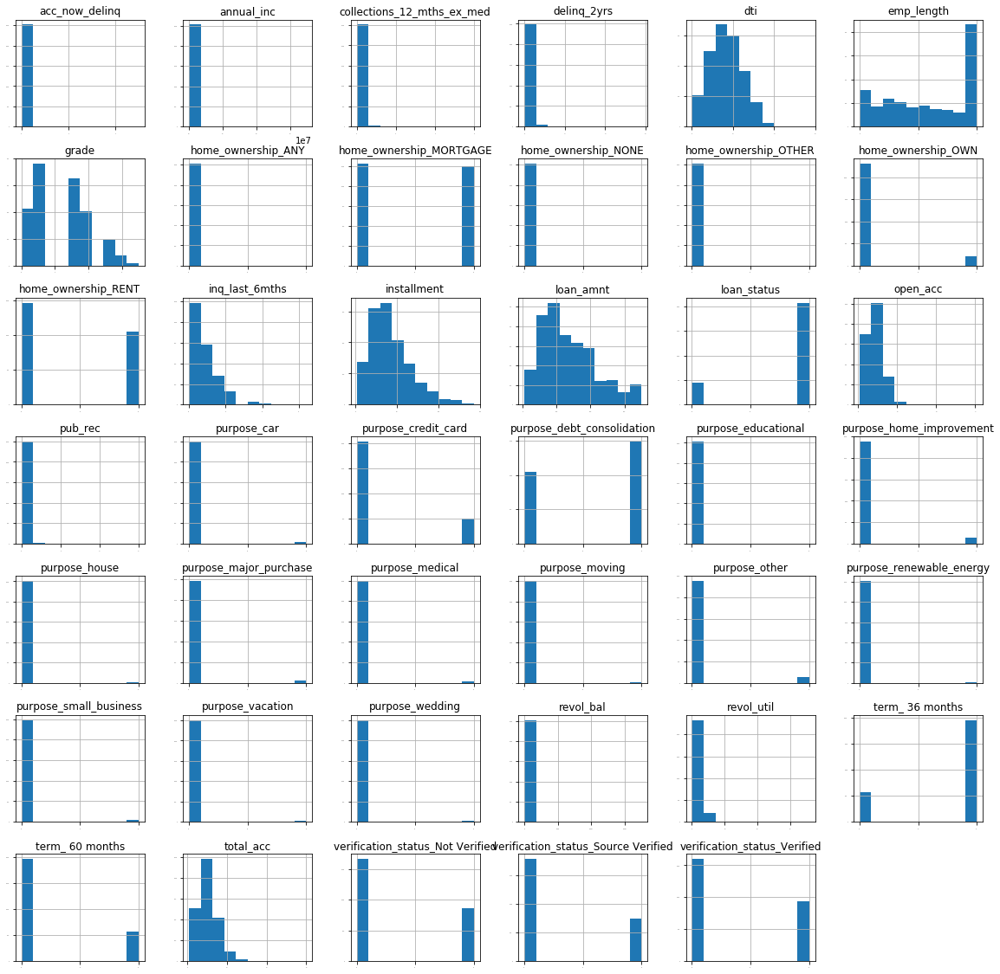
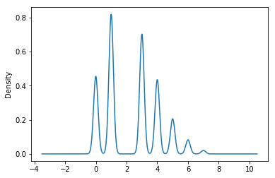
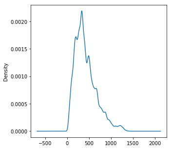
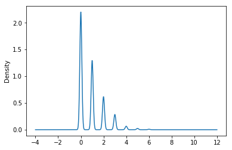
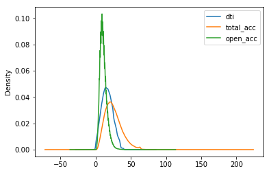
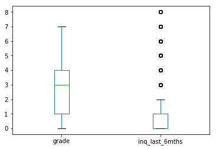
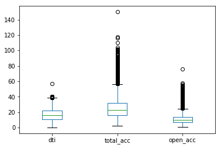

# Lending Club 2007-2011 Loan Prediction

# Data Introduction
Lending club 2007-2011 年信用卡贷款数据

purpose:预测借款人是否能及时还款的影响因素，以减少投资人的损失

# 1.Analyze The Dataset


```python
import pandas as pd
import matplotlib.pyplot as plt
import numpy as np
from pandas.tools.plotting import scatter_matrix
```


```python
loan = pd.read_csv('D:/Documents/Downloads/loan.csv')
print(loan.shape)
print(loan.dtypes)
print(loan.dtypes.value_counts())
```

    F:\Tools\anaconda\lib\site-packages\IPython\core\interactiveshell.py:2717: DtypeWarning: Columns (19,55) have mixed types. Specify dtype option on import or set low_memory=False.
      interactivity=interactivity, compiler=compiler, result=result)
    

    (887379, 74)
    id                               int64
    member_id                        int64
    loan_amnt                      float64
    funded_amnt                    float64
    funded_amnt_inv                float64
    term                            object
    int_rate                       float64
    installment                    float64
    grade                           object
    sub_grade                       object
    emp_title                       object
    emp_length                      object
    home_ownership                  object
    annual_inc                     float64
    verification_status             object
    issue_d                         object
    loan_status                     object
    pymnt_plan                      object
    url                             object
    desc                            object
    purpose                         object
    title                           object
    zip_code                        object
    addr_state                      object
    dti                            float64
    delinq_2yrs                    float64
    earliest_cr_line                object
    inq_last_6mths                 float64
    mths_since_last_delinq         float64
    mths_since_last_record         float64
                                    ...   
    collection_recovery_fee        float64
    last_pymnt_d                    object
    last_pymnt_amnt                float64
    next_pymnt_d                    object
    last_credit_pull_d              object
    collections_12_mths_ex_med     float64
    mths_since_last_major_derog    float64
    policy_code                    float64
    application_type                object
    annual_inc_joint               float64
    dti_joint                      float64
    verification_status_joint       object
    acc_now_delinq                 float64
    tot_coll_amt                   float64
    tot_cur_bal                    float64
    open_acc_6m                    float64
    open_il_6m                     float64
    open_il_12m                    float64
    open_il_24m                    float64
    mths_since_rcnt_il             float64
    total_bal_il                   float64
    il_util                        float64
    open_rv_12m                    float64
    open_rv_24m                    float64
    max_bal_bc                     float64
    all_util                       float64
    total_rev_hi_lim               float64
    inq_fi                         float64
    total_cu_tl                    float64
    inq_last_12m                   float64
    Length: 74, dtype: object
    float64    49
    object     23
    int64       2
    dtype: int64
    

数据集有887379条数据，每条数据有属性73个，且大多数属性是浮点数


```python
print(loan.head())
```

            id  member_id  loan_amnt  funded_amnt  funded_amnt_inv        term  \
    0  1077501    1296599     5000.0       5000.0           4975.0   36 months   
    1  1077430    1314167     2500.0       2500.0           2500.0   60 months   
    2  1077175    1313524     2400.0       2400.0           2400.0   36 months   
    3  1076863    1277178    10000.0      10000.0          10000.0   36 months   
    4  1075358    1311748     3000.0       3000.0           3000.0   60 months   
    
       int_rate  installment grade sub_grade     ...      total_bal_il il_util  \
    0     10.65       162.87     B        B2     ...               NaN     NaN   
    1     15.27        59.83     C        C4     ...               NaN     NaN   
    2     15.96        84.33     C        C5     ...               NaN     NaN   
    3     13.49       339.31     C        C1     ...               NaN     NaN   
    4     12.69        67.79     B        B5     ...               NaN     NaN   
    
      open_rv_12m  open_rv_24m max_bal_bc all_util total_rev_hi_lim inq_fi  \
    0         NaN          NaN        NaN      NaN              NaN    NaN   
    1         NaN          NaN        NaN      NaN              NaN    NaN   
    2         NaN          NaN        NaN      NaN              NaN    NaN   
    3         NaN          NaN        NaN      NaN              NaN    NaN   
    4         NaN          NaN        NaN      NaN              NaN    NaN   
    
      total_cu_tl inq_last_12m  
    0         NaN          NaN  
    1         NaN          NaN  
    2         NaN          NaN  
    3         NaN          NaN  
    4         NaN          NaN  
    
    [5 rows x 74 columns]
    

## 1.1 remove useless columns

1. 移除超过50%的空值的属性

2. 移除与研究目的无关的属性

（1）含大量重复信息的属性

（2）泄露未来信息的属性（借款人贷款后的信息）

（3）不影响判断借款人是否借款的属性

（4）格式很差的属性

（5）需要大量预处理或需挖掘大量潜在信息的属性

1.1（1）移除超过50%的空值的属性


```python
loan_2007 = loan.dropna(thresh = len(loan)/2,axis = 1)
print(loan_2007.columns.tolist())
print(loan_2007.shape[1])
```

    ['id', 'member_id', 'loan_amnt', 'funded_amnt', 'funded_amnt_inv', 'term', 'int_rate', 'installment', 'grade', 'sub_grade', 'emp_title', 'emp_length', 'home_ownership', 'annual_inc', 'verification_status', 'issue_d', 'loan_status', 'pymnt_plan', 'url', 'purpose', 'title', 'zip_code', 'addr_state', 'dti', 'delinq_2yrs', 'earliest_cr_line', 'inq_last_6mths', 'open_acc', 'pub_rec', 'revol_bal', 'revol_util', 'total_acc', 'initial_list_status', 'out_prncp', 'out_prncp_inv', 'total_pymnt', 'total_pymnt_inv', 'total_rec_prncp', 'total_rec_int', 'total_rec_late_fee', 'recoveries', 'collection_recovery_fee', 'last_pymnt_d', 'last_pymnt_amnt', 'next_pymnt_d', 'last_credit_pull_d', 'collections_12_mths_ex_med', 'policy_code', 'application_type', 'acc_now_delinq', 'tot_coll_amt', 'tot_cur_bal', 'total_rev_hi_lim']
    53
    

数据集有74个属性，移除了21个属性

1.1（2）制作变量信息Dataframe


```python
explain = pd.read_csv('D:/Documents/Downloads/LCDataDictionary.csv')
print(explain.columns.tolist())
```

    ['LoanStatNew', 'Description']
    


```python
pd.set_option('max_colwidth',9000)
pd.set_option('max_columns', 100)
explain = explain.rename(columns = {'LoanStatNew':'Name'})
df = pd.DataFrame(loan_2007.dtypes,columns = ['Dtypes'])
df = df.reset_index()
df = df.rename(columns = {'index':'Name'})
df['First_value'] = loan_2007.loc[0].values
df =df.merge(explain,on  ='Name',how = 'left')
df.head()
print(df.shape)
```

    (53, 4)
    

1.1(3) 变量分析：将变量分成3组，前两组各18个，最后一组17个

对第一组18个变量分析


```python
df.loc[0:17]
```


<div>
<style>
    .dataframe thead tr:only-child th {
        text-align: right;
    }

    .dataframe thead th {
        text-align: left;
    }

    .dataframe tbody tr th {
        vertical-align: top;
    }
</style>
<table border="1" class="dataframe">
  <thead>
    <tr style="text-align: right;">
      <th></th>
      <th>Name</th>
      <th>Dtypes</th>
      <th>First_value</th>
      <th>Description</th>
    </tr>
  </thead>
  <tbody>
    <tr>
      <th>0</th>
      <td>id</td>
      <td>int64</td>
      <td>1077501</td>
      <td>A unique LC assigned ID for the loan listing.</td>
    </tr>
    <tr>
      <th>1</th>
      <td>member_id</td>
      <td>int64</td>
      <td>1296599</td>
      <td>A unique LC assigned Id for the borrower member.</td>
    </tr>
    <tr>
      <th>2</th>
      <td>loan_amnt</td>
      <td>float64</td>
      <td>5000</td>
      <td>The listed amount of the loan applied for by the borrower. If at some point in time, the credit department reduces the loan amount, then it will be reflected in this value.</td>
    </tr>
    <tr>
      <th>3</th>
      <td>funded_amnt</td>
      <td>float64</td>
      <td>5000</td>
      <td>The total amount committed to that loan at that point in time.</td>
    </tr>
    <tr>
      <th>4</th>
      <td>funded_amnt_inv</td>
      <td>float64</td>
      <td>4975</td>
      <td>The total amount committed by investors for that loan at that point in time.</td>
    </tr>
    <tr>
      <th>5</th>
      <td>term</td>
      <td>object</td>
      <td>36 months</td>
      <td>The number of payments on the loan. Values are in months and can be either 36 or 60.</td>
    </tr>
    <tr>
      <th>6</th>
      <td>int_rate</td>
      <td>float64</td>
      <td>10.65</td>
      <td>Interest Rate on the loan</td>
    </tr>
    <tr>
      <th>7</th>
      <td>installment</td>
      <td>float64</td>
      <td>162.87</td>
      <td>The monthly payment owed by the borrower if the loan originates.</td>
    </tr>
    <tr>
      <th>8</th>
      <td>grade</td>
      <td>object</td>
      <td>B</td>
      <td>LC assigned loan grade</td>
    </tr>
    <tr>
      <th>9</th>
      <td>sub_grade</td>
      <td>object</td>
      <td>B2</td>
      <td>LC assigned loan subgrade</td>
    </tr>
    <tr>
      <th>10</th>
      <td>emp_title</td>
      <td>object</td>
      <td>NaN</td>
      <td>The job title supplied by the Borrower when applying for the loan.*</td>
    </tr>
    <tr>
      <th>11</th>
      <td>emp_length</td>
      <td>object</td>
      <td>10+ years</td>
      <td>Employment length in years. Possible values are between 0 and 10 where 0 means less than one year and 10 means ten or more years.</td>
    </tr>
    <tr>
      <th>12</th>
      <td>home_ownership</td>
      <td>object</td>
      <td>RENT</td>
      <td>The home ownership status provided by the borrower during registration. Our values are: RENT, OWN, MORTGAGE, OTHER.</td>
    </tr>
    <tr>
      <th>13</th>
      <td>annual_inc</td>
      <td>float64</td>
      <td>24000</td>
      <td>The self-reported annual income provided by the borrower during registration.</td>
    </tr>
    <tr>
      <th>14</th>
      <td>verification_status</td>
      <td>object</td>
      <td>Verified</td>
      <td>Indicates if income was verified by LC, not verified, or if the income source was verified</td>
    </tr>
    <tr>
      <th>15</th>
      <td>issue_d</td>
      <td>object</td>
      <td>Dec-2011</td>
      <td>The month which the loan was funded</td>
    </tr>
    <tr>
      <th>16</th>
      <td>loan_status</td>
      <td>object</td>
      <td>Fully Paid</td>
      <td>Current status of the loan</td>
    </tr>
    <tr>
      <th>17</th>
      <td>pymnt_plan</td>
      <td>object</td>
      <td>n</td>
      <td>Indicates if a payment plan has been put in place for the loan</td>
    </tr>
  </tbody>
</table>
</div>


移除不影响判断借款人是否借款的属性：


```python
 drop_list = ['id','member_id','funded_amnt','funded_amnt_inv',
             'int_rate','sub_grade','emp_title','issue_d']
loan_2007 = loan_2007.drop(drop_list,axis = 1)
```

对第二组18个变量分析


```python
df.loc[18:35]
```


<div>
<style>
    .dataframe thead tr:only-child th {
        text-align: right;
    }

    .dataframe thead th {
        text-align: left;
    }

    .dataframe tbody tr th {
        vertical-align: top;
    }
</style>
<table border="1" class="dataframe">
  <thead>
    <tr style="text-align: right;">
      <th></th>
      <th>Name</th>
      <th>Dtypes</th>
      <th>First_value</th>
      <th>Description</th>
    </tr>
  </thead>
  <tbody>
    <tr>
      <th>18</th>
      <td>url</td>
      <td>object</td>
      <td>https://www.lendingclub.com/browse/loanDetail.action?loan_id=1077501</td>
      <td>URL for the LC page with listing data.</td>
    </tr>
    <tr>
      <th>19</th>
      <td>purpose</td>
      <td>object</td>
      <td>credit_card</td>
      <td>A category provided by the borrower for the loan request.</td>
    </tr>
    <tr>
      <th>20</th>
      <td>title</td>
      <td>object</td>
      <td>Computer</td>
      <td>The loan title provided by the borrower</td>
    </tr>
    <tr>
      <th>21</th>
      <td>zip_code</td>
      <td>object</td>
      <td>860xx</td>
      <td>The first 3 numbers of the zip code provided by the borrower in the loan application.</td>
    </tr>
    <tr>
      <th>22</th>
      <td>addr_state</td>
      <td>object</td>
      <td>AZ</td>
      <td>The state provided by the borrower in the loan application</td>
    </tr>
    <tr>
      <th>23</th>
      <td>dti</td>
      <td>float64</td>
      <td>27.65</td>
      <td>A ratio calculated using the borrower’s total monthly debt payments on the total debt obligations, excluding mortgage and the requested LC loan, divided by the borrower’s self-reported monthly income.</td>
    </tr>
    <tr>
      <th>24</th>
      <td>delinq_2yrs</td>
      <td>float64</td>
      <td>0</td>
      <td>The number of 30+ days past-due incidences of delinquency in the borrower's credit file for the past 2 years</td>
    </tr>
    <tr>
      <th>25</th>
      <td>earliest_cr_line</td>
      <td>object</td>
      <td>Jan-1985</td>
      <td>The month the borrower's earliest reported credit line was opened</td>
    </tr>
    <tr>
      <th>26</th>
      <td>inq_last_6mths</td>
      <td>float64</td>
      <td>1</td>
      <td>The number of inquiries in past 6 months (excluding auto and mortgage inquiries)</td>
    </tr>
    <tr>
      <th>27</th>
      <td>open_acc</td>
      <td>float64</td>
      <td>3</td>
      <td>The number of open credit lines in the borrower's credit file.</td>
    </tr>
    <tr>
      <th>28</th>
      <td>pub_rec</td>
      <td>float64</td>
      <td>0</td>
      <td>Number of derogatory public records</td>
    </tr>
    <tr>
      <th>29</th>
      <td>revol_bal</td>
      <td>float64</td>
      <td>13648</td>
      <td>Total credit revolving balance</td>
    </tr>
    <tr>
      <th>30</th>
      <td>revol_util</td>
      <td>float64</td>
      <td>83.7</td>
      <td>Revolving line utilization rate, or the amount of credit the borrower is using relative to all available revolving credit.</td>
    </tr>
    <tr>
      <th>31</th>
      <td>total_acc</td>
      <td>float64</td>
      <td>9</td>
      <td>The total number of credit lines currently in the borrower's credit file</td>
    </tr>
    <tr>
      <th>32</th>
      <td>initial_list_status</td>
      <td>object</td>
      <td>f</td>
      <td>The initial listing status of the loan. Possible values are – W, F</td>
    </tr>
    <tr>
      <th>33</th>
      <td>out_prncp</td>
      <td>float64</td>
      <td>0</td>
      <td>Remaining outstanding principal for total amount funded</td>
    </tr>
    <tr>
      <th>34</th>
      <td>out_prncp_inv</td>
      <td>float64</td>
      <td>0</td>
      <td>Remaining outstanding principal for portion of total amount funded by investors</td>
    </tr>
    <tr>
      <th>35</th>
      <td>total_pymnt</td>
      <td>float64</td>
      <td>5861.07</td>
      <td>Payments received to date for total amount funded</td>
    </tr>
  </tbody>
</table>
</div>


移除泄露未来信息的属性：zip_code,out_prncp,out_prncp_inv,total_pymnt,total_pymnt_inv

移除无关属性：url  


```python
drop_cols = ['url','zip_code','out_prncp','out_prncp_inv',
             'total_pymnt','total_pymnt_inv']
loan_2007 = loan_2007.drop(drop_cols, axis=1)
```

对第三组变量17个分析


```python
df.loc[36:]
```


<div>
<style>
    .dataframe thead tr:only-child th {
        text-align: right;
    }

    .dataframe thead th {
        text-align: left;
    }

    .dataframe tbody tr th {
        vertical-align: top;
    }
</style>
<table border="1" class="dataframe">
  <thead>
    <tr style="text-align: right;">
      <th></th>
      <th>Name</th>
      <th>Dtypes</th>
      <th>First_value</th>
      <th>Description</th>
    </tr>
  </thead>
  <tbody>
    <tr>
      <th>36</th>
      <td>total_pymnt_inv</td>
      <td>float64</td>
      <td>5831.78</td>
      <td>Payments received to date for portion of total amount funded by investors</td>
    </tr>
    <tr>
      <th>37</th>
      <td>total_rec_prncp</td>
      <td>float64</td>
      <td>5000</td>
      <td>Principal received to date</td>
    </tr>
    <tr>
      <th>38</th>
      <td>total_rec_int</td>
      <td>float64</td>
      <td>861.07</td>
      <td>Interest received to date</td>
    </tr>
    <tr>
      <th>39</th>
      <td>total_rec_late_fee</td>
      <td>float64</td>
      <td>0</td>
      <td>Late fees received to date</td>
    </tr>
    <tr>
      <th>40</th>
      <td>recoveries</td>
      <td>float64</td>
      <td>0</td>
      <td>post charge off gross recovery</td>
    </tr>
    <tr>
      <th>41</th>
      <td>collection_recovery_fee</td>
      <td>float64</td>
      <td>0</td>
      <td>post charge off collection fee</td>
    </tr>
    <tr>
      <th>42</th>
      <td>last_pymnt_d</td>
      <td>object</td>
      <td>Jan-2015</td>
      <td>Last month payment was received</td>
    </tr>
    <tr>
      <th>43</th>
      <td>last_pymnt_amnt</td>
      <td>float64</td>
      <td>171.62</td>
      <td>Last total payment amount received</td>
    </tr>
    <tr>
      <th>44</th>
      <td>next_pymnt_d</td>
      <td>object</td>
      <td>NaN</td>
      <td>Next scheduled payment date</td>
    </tr>
    <tr>
      <th>45</th>
      <td>last_credit_pull_d</td>
      <td>object</td>
      <td>Jan-2016</td>
      <td>The most recent month LC pulled credit for this loan</td>
    </tr>
    <tr>
      <th>46</th>
      <td>collections_12_mths_ex_med</td>
      <td>float64</td>
      <td>0</td>
      <td>Number of collections in 12 months excluding medical collections</td>
    </tr>
    <tr>
      <th>47</th>
      <td>policy_code</td>
      <td>float64</td>
      <td>1</td>
      <td>publicly available policy_code=1\nnew products not publicly available policy_code=2</td>
    </tr>
    <tr>
      <th>48</th>
      <td>application_type</td>
      <td>object</td>
      <td>INDIVIDUAL</td>
      <td>Indicates whether the loan is an individual application or a joint application with two co-borrowers</td>
    </tr>
    <tr>
      <th>49</th>
      <td>acc_now_delinq</td>
      <td>float64</td>
      <td>0</td>
      <td>The number of accounts on which the borrower is now delinquent.</td>
    </tr>
    <tr>
      <th>50</th>
      <td>tot_coll_amt</td>
      <td>float64</td>
      <td>NaN</td>
      <td>Total collection amounts ever owed</td>
    </tr>
    <tr>
      <th>51</th>
      <td>tot_cur_bal</td>
      <td>float64</td>
      <td>NaN</td>
      <td>Total current balance of all accounts</td>
    </tr>
    <tr>
      <th>52</th>
      <td>total_rev_hi_lim</td>
      <td>float64</td>
      <td>NaN</td>
      <td>NaN</td>
    </tr>
  </tbody>
</table>
</div>


移除泄露未来信息的属性


```python
drop_cols = ['total_rec_prncp','total_rec_int', 'total_rec_late_fee',
             'recoveries', 'collection_recovery_fee', 'last_pymnt_d',
             'last_pymnt_amnt']
loan_2007 = loan_2007.drop(drop_cols, axis=1)
```


```python
loan_2007.head()
```


<div>
<style>
    .dataframe thead tr:only-child th {
        text-align: right;
    }

    .dataframe thead th {
        text-align: left;
    }

    .dataframe tbody tr th {
        vertical-align: top;
    }
</style>
<table border="1" class="dataframe">
  <thead>
    <tr style="text-align: right;">
      <th></th>
      <th>loan_amnt</th>
      <th>term</th>
      <th>installment</th>
      <th>grade</th>
      <th>emp_length</th>
      <th>home_ownership</th>
      <th>annual_inc</th>
      <th>verification_status</th>
      <th>loan_status</th>
      <th>pymnt_plan</th>
      <th>purpose</th>
      <th>title</th>
      <th>addr_state</th>
      <th>dti</th>
      <th>delinq_2yrs</th>
      <th>earliest_cr_line</th>
      <th>inq_last_6mths</th>
      <th>open_acc</th>
      <th>pub_rec</th>
      <th>revol_bal</th>
      <th>revol_util</th>
      <th>total_acc</th>
      <th>initial_list_status</th>
      <th>next_pymnt_d</th>
      <th>last_credit_pull_d</th>
      <th>collections_12_mths_ex_med</th>
      <th>policy_code</th>
      <th>application_type</th>
      <th>acc_now_delinq</th>
      <th>tot_coll_amt</th>
      <th>tot_cur_bal</th>
      <th>total_rev_hi_lim</th>
    </tr>
  </thead>
  <tbody>
    <tr>
      <th>0</th>
      <td>5000.0</td>
      <td>36 months</td>
      <td>162.87</td>
      <td>B</td>
      <td>10+ years</td>
      <td>RENT</td>
      <td>24000.0</td>
      <td>Verified</td>
      <td>Fully Paid</td>
      <td>n</td>
      <td>credit_card</td>
      <td>Computer</td>
      <td>AZ</td>
      <td>27.65</td>
      <td>0.0</td>
      <td>Jan-1985</td>
      <td>1.0</td>
      <td>3.0</td>
      <td>0.0</td>
      <td>13648.0</td>
      <td>83.7</td>
      <td>9.0</td>
      <td>f</td>
      <td>NaN</td>
      <td>Jan-2016</td>
      <td>0.0</td>
      <td>1.0</td>
      <td>INDIVIDUAL</td>
      <td>0.0</td>
      <td>NaN</td>
      <td>NaN</td>
      <td>NaN</td>
    </tr>
    <tr>
      <th>1</th>
      <td>2500.0</td>
      <td>60 months</td>
      <td>59.83</td>
      <td>C</td>
      <td>&lt; 1 year</td>
      <td>RENT</td>
      <td>30000.0</td>
      <td>Source Verified</td>
      <td>Charged Off</td>
      <td>n</td>
      <td>car</td>
      <td>bike</td>
      <td>GA</td>
      <td>1.00</td>
      <td>0.0</td>
      <td>Apr-1999</td>
      <td>5.0</td>
      <td>3.0</td>
      <td>0.0</td>
      <td>1687.0</td>
      <td>9.4</td>
      <td>4.0</td>
      <td>f</td>
      <td>NaN</td>
      <td>Sep-2013</td>
      <td>0.0</td>
      <td>1.0</td>
      <td>INDIVIDUAL</td>
      <td>0.0</td>
      <td>NaN</td>
      <td>NaN</td>
      <td>NaN</td>
    </tr>
    <tr>
      <th>2</th>
      <td>2400.0</td>
      <td>36 months</td>
      <td>84.33</td>
      <td>C</td>
      <td>10+ years</td>
      <td>RENT</td>
      <td>12252.0</td>
      <td>Not Verified</td>
      <td>Fully Paid</td>
      <td>n</td>
      <td>small_business</td>
      <td>real estate business</td>
      <td>IL</td>
      <td>8.72</td>
      <td>0.0</td>
      <td>Nov-2001</td>
      <td>2.0</td>
      <td>2.0</td>
      <td>0.0</td>
      <td>2956.0</td>
      <td>98.5</td>
      <td>10.0</td>
      <td>f</td>
      <td>NaN</td>
      <td>Jan-2016</td>
      <td>0.0</td>
      <td>1.0</td>
      <td>INDIVIDUAL</td>
      <td>0.0</td>
      <td>NaN</td>
      <td>NaN</td>
      <td>NaN</td>
    </tr>
    <tr>
      <th>3</th>
      <td>10000.0</td>
      <td>36 months</td>
      <td>339.31</td>
      <td>C</td>
      <td>10+ years</td>
      <td>RENT</td>
      <td>49200.0</td>
      <td>Source Verified</td>
      <td>Fully Paid</td>
      <td>n</td>
      <td>other</td>
      <td>personel</td>
      <td>CA</td>
      <td>20.00</td>
      <td>0.0</td>
      <td>Feb-1996</td>
      <td>1.0</td>
      <td>10.0</td>
      <td>0.0</td>
      <td>5598.0</td>
      <td>21.0</td>
      <td>37.0</td>
      <td>f</td>
      <td>NaN</td>
      <td>Jan-2015</td>
      <td>0.0</td>
      <td>1.0</td>
      <td>INDIVIDUAL</td>
      <td>0.0</td>
      <td>NaN</td>
      <td>NaN</td>
      <td>NaN</td>
    </tr>
    <tr>
      <th>4</th>
      <td>3000.0</td>
      <td>60 months</td>
      <td>67.79</td>
      <td>B</td>
      <td>1 year</td>
      <td>RENT</td>
      <td>80000.0</td>
      <td>Source Verified</td>
      <td>Current</td>
      <td>n</td>
      <td>other</td>
      <td>Personal</td>
      <td>OR</td>
      <td>17.94</td>
      <td>0.0</td>
      <td>Jan-1996</td>
      <td>0.0</td>
      <td>15.0</td>
      <td>0.0</td>
      <td>27783.0</td>
      <td>53.9</td>
      <td>38.0</td>
      <td>f</td>
      <td>Feb-2016</td>
      <td>Jan-2016</td>
      <td>0.0</td>
      <td>1.0</td>
      <td>INDIVIDUAL</td>
      <td>0.0</td>
      <td>NaN</td>
      <td>NaN</td>
      <td>NaN</td>
    </tr>
  </tbody>
</table>
</div>


## 2 Target Attribute

确定目标属性：loan_status(唯一一个与贷款状态相关的属性)

因为研究目的是判断借款人能否及时还款，只关注还款结果，所以只选取fully paid,charged off 
像late,current,default 只是还款过程，无法判断是否能还款

2.1 loan_status 分析


```python
tot_count = loan_2007['loan_status'].value_counts()
print(tot_count)
```

    Current                                                601779
    Fully Paid                                             207723
    Charged Off                                             45248
    Late (31-120 days)                                      11591
    Issued                                                   8460
    In Grace Period                                          6253
    Late (16-30 days)                                        2357
    Does not meet the credit policy. Status:Fully Paid       1988
    Default                                                  1219
    Does not meet the credit policy. Status:Charged Off       761
    Name: loan_status, dtype: int64
    

loan_status中选取值只是fully_paid,charged off的dataframe 


```python
 loan_2007 = loan_2007[(loan_2007['loan_status']=='Fully Paid')|(loan_2007['loan_status']=='Charged Off')]
loan_2007.head()

```


<div>
<style>
    .dataframe thead tr:only-child th {
        text-align: right;
    }

    .dataframe thead th {
        text-align: left;
    }

    .dataframe tbody tr th {
        vertical-align: top;
    }
</style>
<table border="1" class="dataframe">
  <thead>
    <tr style="text-align: right;">
      <th></th>
      <th>loan_amnt</th>
      <th>term</th>
      <th>installment</th>
      <th>grade</th>
      <th>emp_length</th>
      <th>home_ownership</th>
      <th>annual_inc</th>
      <th>verification_status</th>
      <th>loan_status</th>
      <th>pymnt_plan</th>
      <th>purpose</th>
      <th>title</th>
      <th>addr_state</th>
      <th>dti</th>
      <th>delinq_2yrs</th>
      <th>earliest_cr_line</th>
      <th>inq_last_6mths</th>
      <th>open_acc</th>
      <th>pub_rec</th>
      <th>revol_bal</th>
      <th>revol_util</th>
      <th>total_acc</th>
      <th>initial_list_status</th>
      <th>next_pymnt_d</th>
      <th>last_credit_pull_d</th>
      <th>collections_12_mths_ex_med</th>
      <th>policy_code</th>
      <th>application_type</th>
      <th>acc_now_delinq</th>
      <th>tot_coll_amt</th>
      <th>tot_cur_bal</th>
      <th>total_rev_hi_lim</th>
    </tr>
  </thead>
  <tbody>
    <tr>
      <th>0</th>
      <td>5000.0</td>
      <td>36 months</td>
      <td>162.87</td>
      <td>B</td>
      <td>10+ years</td>
      <td>RENT</td>
      <td>24000.0</td>
      <td>Verified</td>
      <td>Fully Paid</td>
      <td>n</td>
      <td>credit_card</td>
      <td>Computer</td>
      <td>AZ</td>
      <td>27.65</td>
      <td>0.0</td>
      <td>Jan-1985</td>
      <td>1.0</td>
      <td>3.0</td>
      <td>0.0</td>
      <td>13648.0</td>
      <td>83.7</td>
      <td>9.0</td>
      <td>f</td>
      <td>NaN</td>
      <td>Jan-2016</td>
      <td>0.0</td>
      <td>1.0</td>
      <td>INDIVIDUAL</td>
      <td>0.0</td>
      <td>NaN</td>
      <td>NaN</td>
      <td>NaN</td>
    </tr>
    <tr>
      <th>1</th>
      <td>2500.0</td>
      <td>60 months</td>
      <td>59.83</td>
      <td>C</td>
      <td>&lt; 1 year</td>
      <td>RENT</td>
      <td>30000.0</td>
      <td>Source Verified</td>
      <td>Charged Off</td>
      <td>n</td>
      <td>car</td>
      <td>bike</td>
      <td>GA</td>
      <td>1.00</td>
      <td>0.0</td>
      <td>Apr-1999</td>
      <td>5.0</td>
      <td>3.0</td>
      <td>0.0</td>
      <td>1687.0</td>
      <td>9.4</td>
      <td>4.0</td>
      <td>f</td>
      <td>NaN</td>
      <td>Sep-2013</td>
      <td>0.0</td>
      <td>1.0</td>
      <td>INDIVIDUAL</td>
      <td>0.0</td>
      <td>NaN</td>
      <td>NaN</td>
      <td>NaN</td>
    </tr>
    <tr>
      <th>2</th>
      <td>2400.0</td>
      <td>36 months</td>
      <td>84.33</td>
      <td>C</td>
      <td>10+ years</td>
      <td>RENT</td>
      <td>12252.0</td>
      <td>Not Verified</td>
      <td>Fully Paid</td>
      <td>n</td>
      <td>small_business</td>
      <td>real estate business</td>
      <td>IL</td>
      <td>8.72</td>
      <td>0.0</td>
      <td>Nov-2001</td>
      <td>2.0</td>
      <td>2.0</td>
      <td>0.0</td>
      <td>2956.0</td>
      <td>98.5</td>
      <td>10.0</td>
      <td>f</td>
      <td>NaN</td>
      <td>Jan-2016</td>
      <td>0.0</td>
      <td>1.0</td>
      <td>INDIVIDUAL</td>
      <td>0.0</td>
      <td>NaN</td>
      <td>NaN</td>
      <td>NaN</td>
    </tr>
    <tr>
      <th>3</th>
      <td>10000.0</td>
      <td>36 months</td>
      <td>339.31</td>
      <td>C</td>
      <td>10+ years</td>
      <td>RENT</td>
      <td>49200.0</td>
      <td>Source Verified</td>
      <td>Fully Paid</td>
      <td>n</td>
      <td>other</td>
      <td>personel</td>
      <td>CA</td>
      <td>20.00</td>
      <td>0.0</td>
      <td>Feb-1996</td>
      <td>1.0</td>
      <td>10.0</td>
      <td>0.0</td>
      <td>5598.0</td>
      <td>21.0</td>
      <td>37.0</td>
      <td>f</td>
      <td>NaN</td>
      <td>Jan-2015</td>
      <td>0.0</td>
      <td>1.0</td>
      <td>INDIVIDUAL</td>
      <td>0.0</td>
      <td>NaN</td>
      <td>NaN</td>
      <td>NaN</td>
    </tr>
    <tr>
      <th>5</th>
      <td>5000.0</td>
      <td>36 months</td>
      <td>156.46</td>
      <td>A</td>
      <td>3 years</td>
      <td>RENT</td>
      <td>36000.0</td>
      <td>Source Verified</td>
      <td>Fully Paid</td>
      <td>n</td>
      <td>wedding</td>
      <td>My wedding loan I promise to pay back</td>
      <td>AZ</td>
      <td>11.20</td>
      <td>0.0</td>
      <td>Nov-2004</td>
      <td>3.0</td>
      <td>9.0</td>
      <td>0.0</td>
      <td>7963.0</td>
      <td>28.3</td>
      <td>12.0</td>
      <td>f</td>
      <td>NaN</td>
      <td>Sep-2015</td>
      <td>0.0</td>
      <td>1.0</td>
      <td>INDIVIDUAL</td>
      <td>0.0</td>
      <td>NaN</td>
      <td>NaN</td>
      <td>NaN</td>
    </tr>
  </tbody>
</table>
</div>


2.2 binary classification problem

将loan_status种类变量转化成整数


```python
map_dic = {'loan_status':{'Fully Paid':1,'Charged Off':0}}
loan_2007 = loan_2007.replace(map_dic)
print(loan_2007.head())
```

       loan_amnt        term  installment grade emp_length home_ownership  \
    0     5000.0   36 months       162.87     B  10+ years           RENT   
    1     2500.0   60 months        59.83     C   < 1 year           RENT   
    2     2400.0   36 months        84.33     C  10+ years           RENT   
    3    10000.0   36 months       339.31     C  10+ years           RENT   
    5     5000.0   36 months       156.46     A    3 years           RENT   
    
       annual_inc verification_status  loan_status pymnt_plan         purpose  \
    0     24000.0            Verified            1          n     credit_card   
    1     30000.0     Source Verified            0          n             car   
    2     12252.0        Not Verified            1          n  small_business   
    3     49200.0     Source Verified            1          n           other   
    5     36000.0     Source Verified            1          n         wedding   
    
                                       title addr_state    dti  delinq_2yrs  \
    0                               Computer         AZ  27.65          0.0   
    1                                   bike         GA   1.00          0.0   
    2                   real estate business         IL   8.72          0.0   
    3                               personel         CA  20.00          0.0   
    5  My wedding loan I promise to pay back         AZ  11.20          0.0   
    
      earliest_cr_line  inq_last_6mths  open_acc  pub_rec  revol_bal  revol_util  \
    0         Jan-1985             1.0       3.0      0.0    13648.0        83.7   
    1         Apr-1999             5.0       3.0      0.0     1687.0         9.4   
    2         Nov-2001             2.0       2.0      0.0     2956.0        98.5   
    3         Feb-1996             1.0      10.0      0.0     5598.0        21.0   
    5         Nov-2004             3.0       9.0      0.0     7963.0        28.3   
    
       total_acc initial_list_status next_pymnt_d last_credit_pull_d  \
    0        9.0                   f          NaN           Jan-2016   
    1        4.0                   f          NaN           Sep-2013   
    2       10.0                   f          NaN           Jan-2016   
    3       37.0                   f          NaN           Jan-2015   
    5       12.0                   f          NaN           Sep-2015   
    
       collections_12_mths_ex_med  policy_code application_type  acc_now_delinq  \
    0                         0.0          1.0       INDIVIDUAL             0.0   
    1                         0.0          1.0       INDIVIDUAL             0.0   
    2                         0.0          1.0       INDIVIDUAL             0.0   
    3                         0.0          1.0       INDIVIDUAL             0.0   
    5                         0.0          1.0       INDIVIDUAL             0.0   
    
       tot_coll_amt  tot_cur_bal  total_rev_hi_lim  
    0           NaN          NaN               NaN  
    1           NaN          NaN               NaN  
    2           NaN          NaN               NaN  
    3           NaN          NaN               NaN  
    5           NaN          NaN               NaN  
    


```python
print(loan_2007['loan_status'].value_counts())
```

    1    207723
    0     45248
    Name: loan_status, dtype: int64
    

## 3. Removing attributes unrelated to the target property

3.1移除只有一个值的变量,与预测结果无关


```python
cols = loan_2007.columns.tolist()
drop_list = []
for col in cols:
    if len(loan_2007[col].dropna().value_counts())==1:
        drop_list.append(col)
print(drop_list)
```

    ['policy_code']
    


```python
loan_2007 = loan_2007.drop(drop_list,axis = 1)
loan_2007.head()
```


<div>
<style>
    .dataframe thead tr:only-child th {
        text-align: right;
    }

    .dataframe thead th {
        text-align: left;
    }

    .dataframe tbody tr th {
        vertical-align: top;
    }
</style>
<table border="1" class="dataframe">
  <thead>
    <tr style="text-align: right;">
      <th></th>
      <th>loan_amnt</th>
      <th>term</th>
      <th>installment</th>
      <th>grade</th>
      <th>emp_length</th>
      <th>home_ownership</th>
      <th>annual_inc</th>
      <th>verification_status</th>
      <th>loan_status</th>
      <th>pymnt_plan</th>
      <th>purpose</th>
      <th>title</th>
      <th>addr_state</th>
      <th>dti</th>
      <th>delinq_2yrs</th>
      <th>earliest_cr_line</th>
      <th>inq_last_6mths</th>
      <th>open_acc</th>
      <th>pub_rec</th>
      <th>revol_bal</th>
      <th>revol_util</th>
      <th>total_acc</th>
      <th>initial_list_status</th>
      <th>next_pymnt_d</th>
      <th>last_credit_pull_d</th>
      <th>collections_12_mths_ex_med</th>
      <th>application_type</th>
      <th>acc_now_delinq</th>
      <th>tot_coll_amt</th>
      <th>tot_cur_bal</th>
      <th>total_rev_hi_lim</th>
    </tr>
  </thead>
  <tbody>
    <tr>
      <th>0</th>
      <td>5000.0</td>
      <td>36 months</td>
      <td>162.87</td>
      <td>B</td>
      <td>10+ years</td>
      <td>RENT</td>
      <td>24000.0</td>
      <td>Verified</td>
      <td>1</td>
      <td>n</td>
      <td>credit_card</td>
      <td>Computer</td>
      <td>AZ</td>
      <td>27.65</td>
      <td>0.0</td>
      <td>Jan-1985</td>
      <td>1.0</td>
      <td>3.0</td>
      <td>0.0</td>
      <td>13648.0</td>
      <td>83.7</td>
      <td>9.0</td>
      <td>f</td>
      <td>NaN</td>
      <td>Jan-2016</td>
      <td>0.0</td>
      <td>INDIVIDUAL</td>
      <td>0.0</td>
      <td>NaN</td>
      <td>NaN</td>
      <td>NaN</td>
    </tr>
    <tr>
      <th>1</th>
      <td>2500.0</td>
      <td>60 months</td>
      <td>59.83</td>
      <td>C</td>
      <td>&lt; 1 year</td>
      <td>RENT</td>
      <td>30000.0</td>
      <td>Source Verified</td>
      <td>0</td>
      <td>n</td>
      <td>car</td>
      <td>bike</td>
      <td>GA</td>
      <td>1.00</td>
      <td>0.0</td>
      <td>Apr-1999</td>
      <td>5.0</td>
      <td>3.0</td>
      <td>0.0</td>
      <td>1687.0</td>
      <td>9.4</td>
      <td>4.0</td>
      <td>f</td>
      <td>NaN</td>
      <td>Sep-2013</td>
      <td>0.0</td>
      <td>INDIVIDUAL</td>
      <td>0.0</td>
      <td>NaN</td>
      <td>NaN</td>
      <td>NaN</td>
    </tr>
    <tr>
      <th>2</th>
      <td>2400.0</td>
      <td>36 months</td>
      <td>84.33</td>
      <td>C</td>
      <td>10+ years</td>
      <td>RENT</td>
      <td>12252.0</td>
      <td>Not Verified</td>
      <td>1</td>
      <td>n</td>
      <td>small_business</td>
      <td>real estate business</td>
      <td>IL</td>
      <td>8.72</td>
      <td>0.0</td>
      <td>Nov-2001</td>
      <td>2.0</td>
      <td>2.0</td>
      <td>0.0</td>
      <td>2956.0</td>
      <td>98.5</td>
      <td>10.0</td>
      <td>f</td>
      <td>NaN</td>
      <td>Jan-2016</td>
      <td>0.0</td>
      <td>INDIVIDUAL</td>
      <td>0.0</td>
      <td>NaN</td>
      <td>NaN</td>
      <td>NaN</td>
    </tr>
    <tr>
      <th>3</th>
      <td>10000.0</td>
      <td>36 months</td>
      <td>339.31</td>
      <td>C</td>
      <td>10+ years</td>
      <td>RENT</td>
      <td>49200.0</td>
      <td>Source Verified</td>
      <td>1</td>
      <td>n</td>
      <td>other</td>
      <td>personel</td>
      <td>CA</td>
      <td>20.00</td>
      <td>0.0</td>
      <td>Feb-1996</td>
      <td>1.0</td>
      <td>10.0</td>
      <td>0.0</td>
      <td>5598.0</td>
      <td>21.0</td>
      <td>37.0</td>
      <td>f</td>
      <td>NaN</td>
      <td>Jan-2015</td>
      <td>0.0</td>
      <td>INDIVIDUAL</td>
      <td>0.0</td>
      <td>NaN</td>
      <td>NaN</td>
      <td>NaN</td>
    </tr>
    <tr>
      <th>5</th>
      <td>5000.0</td>
      <td>36 months</td>
      <td>156.46</td>
      <td>A</td>
      <td>3 years</td>
      <td>RENT</td>
      <td>36000.0</td>
      <td>Source Verified</td>
      <td>1</td>
      <td>n</td>
      <td>wedding</td>
      <td>My wedding loan I promise to pay back</td>
      <td>AZ</td>
      <td>11.20</td>
      <td>0.0</td>
      <td>Nov-2004</td>
      <td>3.0</td>
      <td>9.0</td>
      <td>0.0</td>
      <td>7963.0</td>
      <td>28.3</td>
      <td>12.0</td>
      <td>f</td>
      <td>NaN</td>
      <td>Sep-2015</td>
      <td>0.0</td>
      <td>INDIVIDUAL</td>
      <td>0.0</td>
      <td>NaN</td>
      <td>NaN</td>
      <td>NaN</td>
    </tr>
  </tbody>
</table>
</div>


3.2处理存在空值的属性：若列空值总数超过全部行数的1%，移除此属性，否则只移除个别空值所在行


```python
cols = loan_2007.columns.tolist()
drop = []
for col in cols:
    null = loan_2007[col].isnull().sum()
    per = null/len(loan_2007)
    if per>0.01:
        drop.append(col)
    print(col,null)    
print(drop)
```

    loan_amnt 0
    term 0
    installment 0
    grade 0
    emp_length 0
    home_ownership 0
    annual_inc 0
    verification_status 0
    loan_status 0
    pymnt_plan 0
    purpose 0
    title 12
    addr_state 0
    dti 0
    delinq_2yrs 0
    earliest_cr_line 0
    inq_last_6mths 0
    open_acc 0
    pub_rec 0
    revol_bal 0
    revol_util 199
    total_acc 0
    initial_list_status 0
    next_pymnt_d 252971
    last_credit_pull_d 21
    collections_12_mths_ex_med 56
    application_type 0
    acc_now_delinq 0
    tot_coll_amt 63708
    tot_cur_bal 63708
    total_rev_hi_lim 63708
    ['next_pymnt_d', 'tot_coll_amt', 'tot_cur_bal', 'total_rev_hi_lim']
    


```python
loan_2007 = loan_2007.drop(drop,axis = 1)
loan_2007 = loan_2007.dropna(axis = 0)
print(loan_2007.dtypes.value_counts())
```

    object     13
    float64    13
    int64       1
    dtype: int64
    

3.3转化格式为object的属性为数值型，为训练模型或分析相关性做准备


```python
loan_object = loan_2007.select_dtypes(include = ['O'])
loan_object.head()
```


<div>
<style>
    .dataframe thead tr:only-child th {
        text-align: right;
    }

    .dataframe thead th {
        text-align: left;
    }

    .dataframe tbody tr th {
        vertical-align: top;
    }
</style>
<table border="1" class="dataframe">
  <thead>
    <tr style="text-align: right;">
      <th></th>
      <th>term</th>
      <th>grade</th>
      <th>emp_length</th>
      <th>home_ownership</th>
      <th>verification_status</th>
      <th>pymnt_plan</th>
      <th>purpose</th>
      <th>title</th>
      <th>addr_state</th>
      <th>earliest_cr_line</th>
      <th>initial_list_status</th>
      <th>last_credit_pull_d</th>
      <th>application_type</th>
    </tr>
  </thead>
  <tbody>
    <tr>
      <th>0</th>
      <td>36 months</td>
      <td>B</td>
      <td>10+ years</td>
      <td>RENT</td>
      <td>Verified</td>
      <td>n</td>
      <td>credit_card</td>
      <td>Computer</td>
      <td>AZ</td>
      <td>Jan-1985</td>
      <td>f</td>
      <td>Jan-2016</td>
      <td>INDIVIDUAL</td>
    </tr>
    <tr>
      <th>1</th>
      <td>60 months</td>
      <td>C</td>
      <td>&lt; 1 year</td>
      <td>RENT</td>
      <td>Source Verified</td>
      <td>n</td>
      <td>car</td>
      <td>bike</td>
      <td>GA</td>
      <td>Apr-1999</td>
      <td>f</td>
      <td>Sep-2013</td>
      <td>INDIVIDUAL</td>
    </tr>
    <tr>
      <th>2</th>
      <td>36 months</td>
      <td>C</td>
      <td>10+ years</td>
      <td>RENT</td>
      <td>Not Verified</td>
      <td>n</td>
      <td>small_business</td>
      <td>real estate business</td>
      <td>IL</td>
      <td>Nov-2001</td>
      <td>f</td>
      <td>Jan-2016</td>
      <td>INDIVIDUAL</td>
    </tr>
    <tr>
      <th>3</th>
      <td>36 months</td>
      <td>C</td>
      <td>10+ years</td>
      <td>RENT</td>
      <td>Source Verified</td>
      <td>n</td>
      <td>other</td>
      <td>personel</td>
      <td>CA</td>
      <td>Feb-1996</td>
      <td>f</td>
      <td>Jan-2015</td>
      <td>INDIVIDUAL</td>
    </tr>
    <tr>
      <th>5</th>
      <td>36 months</td>
      <td>A</td>
      <td>3 years</td>
      <td>RENT</td>
      <td>Source Verified</td>
      <td>n</td>
      <td>wedding</td>
      <td>My wedding loan I promise to pay back</td>
      <td>AZ</td>
      <td>Nov-2004</td>
      <td>f</td>
      <td>Sep-2015</td>
      <td>INDIVIDUAL</td>
    </tr>
  </tbody>
</table>
</div>


```python
cols = loan_object.columns.tolist()
for col in cols:
    print(loan_object[col].value_counts())
```

     36 months    196415
     60 months     56268
    Name: term, dtype: int64
    B    76014
    C    65249
    A    42259
    D    40438
    E    19147
    F     7644
    G     1932
    Name: grade, dtype: int64
    10+ years    76826
    2 years      23534
    < 1 year     20837
    3 years      20361
    5 years      18040
    1 year       16828
    4 years      16176
    6 years      14735
    7 years      14065
    8 years      11839
    n/a           9887
    9 years       9555
    Name: emp_length, dtype: int64
    MORTGAGE    124713
    RENT        105838
    OWN          21951
    OTHER          139
    NONE            41
    ANY              1
    Name: home_ownership, dtype: int64
    Verified           92809
    Not Verified       85930
    Source Verified    73944
    Name: verification_status, dtype: int64
    n    252681
    y         2
    Name: pymnt_plan, dtype: int64
    debt_consolidation    148257
    credit_card            50044
    home_improvement       14898
    other                  14233
    major_purchase          6248
    small_business          4733
    car                     3638
    medical                 2841
    moving                  2023
    wedding                 1952
    house                   1651
    vacation                1581
    educational              317
    renewable_energy         267
    Name: purpose, dtype: int64
    Debt consolidation                                                              72031
    Credit card refinancing                                                         22784
    Debt Consolidation                                                              11086
    Home improvement                                                                 6733
    Other                                                                            6025
    Consolidation                                                                    3566
    debt consolidation                                                               3215
    Debt Consolidation Loan                                                          3057
    Major purchase                                                                   2152
    Business                                                                         1742
    Credit Card Consolidation                                                        1625
    Personal Loan                                                                    1603
    consolidation                                                                    1380
    Medical expenses                                                                 1362
    Home Improvement                                                                 1242
    Consolidation Loan                                                               1201
    Credit Card Refinance                                                             975
    Car financing                                                                     975
    Credit Card Payoff                                                                886
    Vacation                                                                          862
    Personal                                                                          855
    Consolidate                                                                       828
    Moving and relocation                                                             806
    Loan                                                                              726
    Credit Card Loan                                                                  621
    Home buying                                                                       618
    personal                                                                          561
    personal loan                                                                     559
    Freedom                                                                           505
    consolidate                                                                       491
                                                                                    ...  
    Breathing Room!                                                                     1
    No more credit cards, a lot less debt.                                              1
    debt consolidated credit bills                                                      1
    busting through the clouds                                                          1
    Purchasing a used car                                                               1
    Reseting life into an easy 1 location payment                                       1
    Caroline Lending Club Loan                                                          1
    Personal Loan - Colorado                                                            1
    consolidation to one note                                                           1
    Patricks first lending club loan                                                    1
    Chase and Capital One Refinance                                                     1
    T's consolidation                                                                   1
    Pay down!!                                                                          1
    STUDENT DEBT CONSOLIDATION                                                          1
    To live and die debt free                                                           1
     Debt Payoff Plan                                                                   1
    Add Cement & Storage                                                                1
    High Interest Debt Relief/Consolidation                                             1
    bye, bye credit card                                                                1
    Sugar Daddy                                                                         1
    personal loan to pay off credit card det                                            1
    Consolacion                                                                         1
    Refinancing my Life                                                                 1
    976percentfor36months                                                               1
    Lending Club CC                                                                     1
    lower monthly payment loan                                                          1
    Pay out car loan with better ARP                                                    1
    I have never missed a payment, this loan reduces my monthly outflow as well.        1
    d.everett SOS…Hail Mary Time! Double-down & we can score the WIN-WIN!               1
    smaller loan                                                                        1
    Name: title, Length: 47828, dtype: int64
    CA    43066
    NY    21315
    TX    19328
    FL    17528
    NJ     9588
    IL     9248
    PA     8387
    GA     8003
    VA     7931
    OH     7726
    NC     6914
    MA     6122
    AZ     6070
    MD     5999
    MI     5994
    WA     5912
    CO     5608
    MN     4454
    MO     3951
    NV     3805
    CT     3678
    OR     3349
    AL     3144
    WI     3067
    LA     2945
    SC     2817
    IN     2797
    TN     2425
    KY     2266
    OK     2128
    UT     2110
    KS     2079
    AR     1752
    HI     1473
    NM     1377
    NH     1146
    WV     1137
    RI     1087
    DC      833
    MT      736
    DE      665
    AK      663
    WY      602
    SD      542
    VT      427
    MS      421
    NE       36
    ME       12
    ND        8
    IA        6
    ID        6
    Name: addr_state, dtype: int64
    Oct-2000    2110
    Oct-1999    1964
    Oct-2001    1958
    Nov-2000    1922
    Aug-2000    1921
    Nov-1999    1889
    Aug-2001    1797
    Sep-2000    1761
    Dec-2000    1761
    Sep-2001    1724
    Oct-2002    1714
    Dec-1998    1711
    Dec-1999    1696
    Aug-1999    1662
    Sep-1999    1643
    Jan-2001    1642
    Sep-2002    1637
    Nov-1998    1633
    Jul-2000    1601
    Oct-1998    1599
    Dec-2001    1590
    May-2001    1576
    Nov-2001    1573
    Jan-2000    1573
    Jul-2001    1569
    May-2000    1562
    Jun-2001    1514
    Aug-1998    1510
    Aug-2002    1503
    Sep-2003    1499
                ... 
    Jul-1958       1
    Mar-1965       1
    Sep-1959       1
    May-1962       1
    Apr-1955       1
    Jul-1964       1
    Dec-1960       1
    Aug-1950       1
    Aug-2012       1
    Jun-1957       1
    Aug-1960       1
    Sep-1960       1
    Mar-1961       1
    Nov-1955       1
    Jan-1946       1
    Sep-1956       1
    Dec-1950       1
    May-1959       1
    Aug-1963       1
    Jan-1948       1
    Oct-2012       1
    May-1960       1
    Mar-1960       1
    Nov-1956       1
    Oct-1961       1
    Nov-1959       1
    Dec-1958       1
    Oct-1958       1
    Jan-1959       1
    Apr-1963       1
    Name: earliest_cr_line, Length: 644, dtype: int64
    f    181845
    w     70838
    Name: initial_list_status, dtype: int64
    Jan-2016    101998
    Dec-2015     18469
    Nov-2015     10925
    Oct-2015      9935
    Sep-2015      9690
    Jul-2015      8323
    Aug-2015      7728
    Jun-2015      6902
    Apr-2015      5991
    May-2015      5756
    Mar-2015      5633
    Feb-2015      4879
    Jan-2015      4766
    Dec-2014      3665
    Oct-2014      3330
    Nov-2014      3144
    Sep-2014      2929
    Aug-2014      2792
    Jul-2014      2746
    May-2014      2276
    Jun-2014      2212
    Mar-2014      2183
    Apr-2014      2158
    Feb-2014      1901
    Jan-2014      1770
    Feb-2013      1395
    Nov-2013      1383
    Dec-2013      1373
    Oct-2013      1250
    Sep-2013      1041
                 ...  
    Aug-2010        51
    Mar-2010        49
    Jun-2010        46
    Dec-2009        45
    Oct-2009        34
    Nov-2009        29
    Jan-2010        26
    Aug-2009        19
    Feb-2009        16
    Apr-2009        16
    Jan-2009        16
    Jun-2009        13
    Jul-2009        13
    Aug-2007        13
    Mar-2009        10
    May-2009        10
    Sep-2009        10
    Aug-2008         9
    Oct-2008         9
    Sep-2008         5
    Dec-2008         5
    Mar-2008         4
    Feb-2008         3
    Jan-2008         3
    Oct-2007         3
    Sep-2007         2
    Dec-2007         2
    Jul-2008         1
    Jun-2008         1
    May-2008         1
    Name: last_credit_pull_d, Length: 99, dtype: int64
    INDIVIDUAL    252682
    JOINT              1
    Name: application_type, dtype: int64
    

移除变量几乎只存在单一值，无法对预测结果产生影响：application_type，pymnt_plan


```python
list = ['pymnt_plan','application_type']
loan_object = loan_object.drop(list,axis = 1)
print(loan_object.columns)
```

    Index(['term', 'grade', 'emp_length', 'home_ownership', 'verification_status',
           'purpose', 'title', 'addr_state', 'earliest_cr_line',
           'initial_list_status', 'last_credit_pull_d'],
          dtype='object')
    


```python
loan_2007  =loan_2007.drop(list,axis  =1)
```

对emp_length,grade分析：转化为数值后具有顺序性


```python
map_dic = {'grade':{'A':0,'B':1,'C':3,'D':4,'E':5,'F':6,'G':7}}
map_d ={'emp_length':{'10+ years':10,'2 years':2 ,'< 1 year':0,
                      '3 years':3 ,'5 years':5 ,'1 year':1 ,'4 years':4, 
                     '6 years':6 ,'7 years':7 ,'8 years':8 ,'n/a':0,'9 years':9}}
loan_2007  =loan_2007.replace(map_d)
loan_2007 = loan_2007.replace(map_dic)
```


```python
loan_object.columns

```


    Index(['term', 'grade', 'emp_length', 'home_ownership', 'verification_status',
           'purpose', 'title', 'addr_state', 'earliest_cr_line',
           'initial_list_status', 'last_credit_pull_d'],
          dtype='object')


```python
#对title,purpose 分析
print(loan_object['title'].value_counts())
print(loan_object['purpose'].value_counts())
```

    Debt consolidation                                                              72031
    Credit card refinancing                                                         22784
    Debt Consolidation                                                              11086
    Home improvement                                                                 6733
    Other                                                                            6025
    Consolidation                                                                    3566
    debt consolidation                                                               3215
    Debt Consolidation Loan                                                          3057
    Major purchase                                                                   2152
    Business                                                                         1742
    Credit Card Consolidation                                                        1625
    Personal Loan                                                                    1603
    consolidation                                                                    1380
    Medical expenses                                                                 1362
    Home Improvement                                                                 1242
    Consolidation Loan                                                               1201
    Credit Card Refinance                                                             975
    Car financing                                                                     975
    Credit Card Payoff                                                                886
    Vacation                                                                          862
    Personal                                                                          855
    Consolidate                                                                       828
    Moving and relocation                                                             806
    Loan                                                                              726
    Credit Card Loan                                                                  621
    Home buying                                                                       618
    personal                                                                          561
    personal loan                                                                     559
    Freedom                                                                           505
    consolidate                                                                       491
                                                                                    ...  
    Breathing Room!                                                                     1
    No more credit cards, a lot less debt.                                              1
    debt consolidated credit bills                                                      1
    busting through the clouds                                                          1
    Purchasing a used car                                                               1
    Reseting life into an easy 1 location payment                                       1
    Caroline Lending Club Loan                                                          1
    Personal Loan - Colorado                                                            1
    consolidation to one note                                                           1
    Patricks first lending club loan                                                    1
    Chase and Capital One Refinance                                                     1
    T's consolidation                                                                   1
    Pay down!!                                                                          1
    STUDENT DEBT CONSOLIDATION                                                          1
    To live and die debt free                                                           1
     Debt Payoff Plan                                                                   1
    Add Cement & Storage                                                                1
    High Interest Debt Relief/Consolidation                                             1
    bye, bye credit card                                                                1
    Sugar Daddy                                                                         1
    personal loan to pay off credit card det                                            1
    Consolacion                                                                         1
    Refinancing my Life                                                                 1
    976percentfor36months                                                               1
    Lending Club CC                                                                     1
    lower monthly payment loan                                                          1
    Pay out car loan with better ARP                                                    1
    I have never missed a payment, this loan reduces my monthly outflow as well.        1
    d.everett SOS…Hail Mary Time! Double-down & we can score the WIN-WIN!               1
    smaller loan                                                                        1
    Name: title, Length: 47828, dtype: int64
    debt_consolidation    148257
    credit_card            50044
    home_improvement       14898
    other                  14233
    major_purchase          6248
    small_business          4733
    car                     3638
    medical                 2841
    moving                  2023
    wedding                 1952
    house                   1651
    vacation                1581
    educational              317
    renewable_energy         267
    Name: purpose, dtype: int64
    

title 存在数据质量问题：大量重复信息，需移除

'addr_state' 种类变量值太多，会影响模型运行速度和dataframe建造速度，需移除

'earliest_cr_line','initial_list_status', 'last_credit_pull_d'存在大量潜在挖掘信息，

需要后续预处理，需移除


```python
print(loan_object['addr_state'].value_counts())
```

    CA    43066
    NY    21315
    TX    19328
    FL    17528
    NJ     9588
    IL     9248
    PA     8387
    GA     8003
    VA     7931
    OH     7726
    NC     6914
    MA     6122
    AZ     6070
    MD     5999
    MI     5994
    WA     5912
    CO     5608
    MN     4454
    MO     3951
    NV     3805
    CT     3678
    OR     3349
    AL     3144
    WI     3067
    LA     2945
    SC     2817
    IN     2797
    TN     2425
    KY     2266
    OK     2128
    UT     2110
    KS     2079
    AR     1752
    HI     1473
    NM     1377
    NH     1146
    WV     1137
    RI     1087
    DC      833
    MT      736
    DE      665
    AK      663
    WY      602
    SD      542
    VT      427
    MS      421
    NE       36
    ME       12
    ND        8
    IA        6
    ID        6
    Name: addr_state, dtype: int64
    


```python
dp = ['addr_state','title','earliest_cr_line','initial_list_status', 'last_credit_pull_d']
loan_2007 = loan_2007.drop(dp,axis = 1)
```


```python
print(loan_2007.shape[1])
```

    20
    

3.3制造虚拟变量


```python
dummies = ['term','home_ownership', 'verification_status', 'purpose']
loan_dummy = pd.get_dummies(loan_2007[dummies])
loan_dummy.head()
```


<div>
<style>
    .dataframe thead tr:only-child th {
        text-align: right;
    }

    .dataframe thead th {
        text-align: left;
    }

    .dataframe tbody tr th {
        vertical-align: top;
    }
</style>
<table border="1" class="dataframe">
  <thead>
    <tr style="text-align: right;">
      <th></th>
      <th>term_ 36 months</th>
      <th>term_ 60 months</th>
      <th>home_ownership_ANY</th>
      <th>home_ownership_MORTGAGE</th>
      <th>home_ownership_NONE</th>
      <th>home_ownership_OTHER</th>
      <th>home_ownership_OWN</th>
      <th>home_ownership_RENT</th>
      <th>verification_status_Not Verified</th>
      <th>verification_status_Source Verified</th>
      <th>verification_status_Verified</th>
      <th>purpose_car</th>
      <th>purpose_credit_card</th>
      <th>purpose_debt_consolidation</th>
      <th>purpose_educational</th>
      <th>purpose_home_improvement</th>
      <th>purpose_house</th>
      <th>purpose_major_purchase</th>
      <th>purpose_medical</th>
      <th>purpose_moving</th>
      <th>purpose_other</th>
      <th>purpose_renewable_energy</th>
      <th>purpose_small_business</th>
      <th>purpose_vacation</th>
      <th>purpose_wedding</th>
    </tr>
  </thead>
  <tbody>
    <tr>
      <th>0</th>
      <td>1</td>
      <td>0</td>
      <td>0</td>
      <td>0</td>
      <td>0</td>
      <td>0</td>
      <td>0</td>
      <td>1</td>
      <td>0</td>
      <td>0</td>
      <td>1</td>
      <td>0</td>
      <td>1</td>
      <td>0</td>
      <td>0</td>
      <td>0</td>
      <td>0</td>
      <td>0</td>
      <td>0</td>
      <td>0</td>
      <td>0</td>
      <td>0</td>
      <td>0</td>
      <td>0</td>
      <td>0</td>
    </tr>
    <tr>
      <th>1</th>
      <td>0</td>
      <td>1</td>
      <td>0</td>
      <td>0</td>
      <td>0</td>
      <td>0</td>
      <td>0</td>
      <td>1</td>
      <td>0</td>
      <td>1</td>
      <td>0</td>
      <td>1</td>
      <td>0</td>
      <td>0</td>
      <td>0</td>
      <td>0</td>
      <td>0</td>
      <td>0</td>
      <td>0</td>
      <td>0</td>
      <td>0</td>
      <td>0</td>
      <td>0</td>
      <td>0</td>
      <td>0</td>
    </tr>
    <tr>
      <th>2</th>
      <td>1</td>
      <td>0</td>
      <td>0</td>
      <td>0</td>
      <td>0</td>
      <td>0</td>
      <td>0</td>
      <td>1</td>
      <td>1</td>
      <td>0</td>
      <td>0</td>
      <td>0</td>
      <td>0</td>
      <td>0</td>
      <td>0</td>
      <td>0</td>
      <td>0</td>
      <td>0</td>
      <td>0</td>
      <td>0</td>
      <td>0</td>
      <td>0</td>
      <td>1</td>
      <td>0</td>
      <td>0</td>
    </tr>
    <tr>
      <th>3</th>
      <td>1</td>
      <td>0</td>
      <td>0</td>
      <td>0</td>
      <td>0</td>
      <td>0</td>
      <td>0</td>
      <td>1</td>
      <td>0</td>
      <td>1</td>
      <td>0</td>
      <td>0</td>
      <td>0</td>
      <td>0</td>
      <td>0</td>
      <td>0</td>
      <td>0</td>
      <td>0</td>
      <td>0</td>
      <td>0</td>
      <td>1</td>
      <td>0</td>
      <td>0</td>
      <td>0</td>
      <td>0</td>
    </tr>
    <tr>
      <th>5</th>
      <td>1</td>
      <td>0</td>
      <td>0</td>
      <td>0</td>
      <td>0</td>
      <td>0</td>
      <td>0</td>
      <td>1</td>
      <td>0</td>
      <td>1</td>
      <td>0</td>
      <td>0</td>
      <td>0</td>
      <td>0</td>
      <td>0</td>
      <td>0</td>
      <td>0</td>
      <td>0</td>
      <td>0</td>
      <td>0</td>
      <td>0</td>
      <td>0</td>
      <td>0</td>
      <td>0</td>
      <td>1</td>
    </tr>
  </tbody>
</table>
</div>


```python
loan_2007= pd.concat([loan_2007,loan_dummy],axis  =1)
loan_2007 = loan_2007.drop(dummies,axis  =1)
loan_2007.head()
```


<div>
<style>
    .dataframe thead tr:only-child th {
        text-align: right;
    }

    .dataframe thead th {
        text-align: left;
    }

    .dataframe tbody tr th {
        vertical-align: top;
    }
</style>
<table border="1" class="dataframe">
  <thead>
    <tr style="text-align: right;">
      <th></th>
      <th>loan_amnt</th>
      <th>installment</th>
      <th>grade</th>
      <th>emp_length</th>
      <th>annual_inc</th>
      <th>loan_status</th>
      <th>dti</th>
      <th>delinq_2yrs</th>
      <th>inq_last_6mths</th>
      <th>open_acc</th>
      <th>pub_rec</th>
      <th>revol_bal</th>
      <th>revol_util</th>
      <th>total_acc</th>
      <th>collections_12_mths_ex_med</th>
      <th>acc_now_delinq</th>
      <th>term_ 36 months</th>
      <th>term_ 60 months</th>
      <th>home_ownership_ANY</th>
      <th>home_ownership_MORTGAGE</th>
      <th>home_ownership_NONE</th>
      <th>home_ownership_OTHER</th>
      <th>home_ownership_OWN</th>
      <th>home_ownership_RENT</th>
      <th>verification_status_Not Verified</th>
      <th>verification_status_Source Verified</th>
      <th>verification_status_Verified</th>
      <th>purpose_car</th>
      <th>purpose_credit_card</th>
      <th>purpose_debt_consolidation</th>
      <th>purpose_educational</th>
      <th>purpose_home_improvement</th>
      <th>purpose_house</th>
      <th>purpose_major_purchase</th>
      <th>purpose_medical</th>
      <th>purpose_moving</th>
      <th>purpose_other</th>
      <th>purpose_renewable_energy</th>
      <th>purpose_small_business</th>
      <th>purpose_vacation</th>
      <th>purpose_wedding</th>
    </tr>
  </thead>
  <tbody>
    <tr>
      <th>0</th>
      <td>5000.0</td>
      <td>162.87</td>
      <td>1</td>
      <td>10</td>
      <td>24000.0</td>
      <td>1</td>
      <td>27.65</td>
      <td>0.0</td>
      <td>1.0</td>
      <td>3.0</td>
      <td>0.0</td>
      <td>13648.0</td>
      <td>83.7</td>
      <td>9.0</td>
      <td>0.0</td>
      <td>0.0</td>
      <td>1</td>
      <td>0</td>
      <td>0</td>
      <td>0</td>
      <td>0</td>
      <td>0</td>
      <td>0</td>
      <td>1</td>
      <td>0</td>
      <td>0</td>
      <td>1</td>
      <td>0</td>
      <td>1</td>
      <td>0</td>
      <td>0</td>
      <td>0</td>
      <td>0</td>
      <td>0</td>
      <td>0</td>
      <td>0</td>
      <td>0</td>
      <td>0</td>
      <td>0</td>
      <td>0</td>
      <td>0</td>
    </tr>
    <tr>
      <th>1</th>
      <td>2500.0</td>
      <td>59.83</td>
      <td>3</td>
      <td>0</td>
      <td>30000.0</td>
      <td>0</td>
      <td>1.00</td>
      <td>0.0</td>
      <td>5.0</td>
      <td>3.0</td>
      <td>0.0</td>
      <td>1687.0</td>
      <td>9.4</td>
      <td>4.0</td>
      <td>0.0</td>
      <td>0.0</td>
      <td>0</td>
      <td>1</td>
      <td>0</td>
      <td>0</td>
      <td>0</td>
      <td>0</td>
      <td>0</td>
      <td>1</td>
      <td>0</td>
      <td>1</td>
      <td>0</td>
      <td>1</td>
      <td>0</td>
      <td>0</td>
      <td>0</td>
      <td>0</td>
      <td>0</td>
      <td>0</td>
      <td>0</td>
      <td>0</td>
      <td>0</td>
      <td>0</td>
      <td>0</td>
      <td>0</td>
      <td>0</td>
    </tr>
    <tr>
      <th>2</th>
      <td>2400.0</td>
      <td>84.33</td>
      <td>3</td>
      <td>10</td>
      <td>12252.0</td>
      <td>1</td>
      <td>8.72</td>
      <td>0.0</td>
      <td>2.0</td>
      <td>2.0</td>
      <td>0.0</td>
      <td>2956.0</td>
      <td>98.5</td>
      <td>10.0</td>
      <td>0.0</td>
      <td>0.0</td>
      <td>1</td>
      <td>0</td>
      <td>0</td>
      <td>0</td>
      <td>0</td>
      <td>0</td>
      <td>0</td>
      <td>1</td>
      <td>1</td>
      <td>0</td>
      <td>0</td>
      <td>0</td>
      <td>0</td>
      <td>0</td>
      <td>0</td>
      <td>0</td>
      <td>0</td>
      <td>0</td>
      <td>0</td>
      <td>0</td>
      <td>0</td>
      <td>0</td>
      <td>1</td>
      <td>0</td>
      <td>0</td>
    </tr>
    <tr>
      <th>3</th>
      <td>10000.0</td>
      <td>339.31</td>
      <td>3</td>
      <td>10</td>
      <td>49200.0</td>
      <td>1</td>
      <td>20.00</td>
      <td>0.0</td>
      <td>1.0</td>
      <td>10.0</td>
      <td>0.0</td>
      <td>5598.0</td>
      <td>21.0</td>
      <td>37.0</td>
      <td>0.0</td>
      <td>0.0</td>
      <td>1</td>
      <td>0</td>
      <td>0</td>
      <td>0</td>
      <td>0</td>
      <td>0</td>
      <td>0</td>
      <td>1</td>
      <td>0</td>
      <td>1</td>
      <td>0</td>
      <td>0</td>
      <td>0</td>
      <td>0</td>
      <td>0</td>
      <td>0</td>
      <td>0</td>
      <td>0</td>
      <td>0</td>
      <td>0</td>
      <td>1</td>
      <td>0</td>
      <td>0</td>
      <td>0</td>
      <td>0</td>
    </tr>
    <tr>
      <th>5</th>
      <td>5000.0</td>
      <td>156.46</td>
      <td>0</td>
      <td>3</td>
      <td>36000.0</td>
      <td>1</td>
      <td>11.20</td>
      <td>0.0</td>
      <td>3.0</td>
      <td>9.0</td>
      <td>0.0</td>
      <td>7963.0</td>
      <td>28.3</td>
      <td>12.0</td>
      <td>0.0</td>
      <td>0.0</td>
      <td>1</td>
      <td>0</td>
      <td>0</td>
      <td>0</td>
      <td>0</td>
      <td>0</td>
      <td>0</td>
      <td>1</td>
      <td>0</td>
      <td>1</td>
      <td>0</td>
      <td>0</td>
      <td>0</td>
      <td>0</td>
      <td>0</td>
      <td>0</td>
      <td>0</td>
      <td>0</td>
      <td>0</td>
      <td>0</td>
      <td>0</td>
      <td>0</td>
      <td>0</td>
      <td>0</td>
      <td>1</td>
    </tr>
  </tbody>
</table>
</div>


```python
loan_2007.to_csv('loan_2007_sample.csv')
```


```python
print(loan_2007.dtypes)
```

    loan_amnt                              float64
    installment                            float64
    grade                                    int64
    emp_length                               int64
    annual_inc                             float64
    loan_status                              int64
    dti                                    float64
    delinq_2yrs                            float64
    inq_last_6mths                         float64
    open_acc                               float64
    pub_rec                                float64
    revol_bal                              float64
    revol_util                             float64
    total_acc                              float64
    collections_12_mths_ex_med             float64
    acc_now_delinq                         float64
    term_ 36 months                          uint8
    term_ 60 months                          uint8
    home_ownership_ANY                       uint8
    home_ownership_MORTGAGE                  uint8
    home_ownership_NONE                      uint8
    home_ownership_OTHER                     uint8
    home_ownership_OWN                       uint8
    home_ownership_RENT                      uint8
    verification_status_Not Verified         uint8
    verification_status_Source Verified      uint8
    verification_status_Verified             uint8
    purpose_car                              uint8
    purpose_credit_card                      uint8
    purpose_debt_consolidation               uint8
    purpose_educational                      uint8
    purpose_home_improvement                 uint8
    purpose_house                            uint8
    purpose_major_purchase                   uint8
    purpose_medical                          uint8
    purpose_moving                           uint8
    purpose_other                            uint8
    purpose_renewable_energy                 uint8
    purpose_small_business                   uint8
    purpose_vacation                         uint8
    purpose_wedding                          uint8
    dtype: object
    


```python
loan_dummies_all = loan_dummy.shape[1]
print(loan_dummies_all)
print(loan_2007.shape[1])
```

    25
    41
    

至此，将原数据变量74个经过分析移除，得到现数据变量41个且都转化为数值形式，其中虚拟变量25个

以下开始寻找影响目标变量（loan_status）的因素：

## 4 Data Visualization


```python
loan_2007.hist(sharex=False, sharey=False, xlabelsize=1, ylabelsize=1,figsize = (20,20))
plt.show()
```





```python
loan_2007['grade'].plot.kde()
plt.show()
```





```python
loan_2007['installment'].plot.kde(figsize = (5,5))
plt.show()
```





```python
loan_2007['inq_last_6mths'].plot(kind = 'density')
plt.show()
```





```python
loan_2007[['dti','total_acc','open_acc']].plot(kind = 'density')
plt.show()
```





发现dti,total_acc,open_acc,grade可能为尖峰分布，installment，loan_amnt可能为右偏分布，inq_last_6mths可能为指数族分布


```python
de = loan_2007[['grade','inq_last_6mths']]
de.plot(kind='box')
plt.show()
```





```python
loan_2007[['dti','total_acc','open_acc']].plot(kind = 'box')
plt.show()
```





```python
loan_2007.describe()
```


<div>
<style>
    .dataframe thead tr:only-child th {
        text-align: right;
    }

    .dataframe thead th {
        text-align: left;
    }

    .dataframe tbody tr th {
        vertical-align: top;
    }
</style>
<table border="1" class="dataframe">
  <thead>
    <tr style="text-align: right;">
      <th></th>
      <th>loan_amnt</th>
      <th>installment</th>
      <th>grade</th>
      <th>emp_length</th>
      <th>annual_inc</th>
      <th>loan_status</th>
      <th>dti</th>
      <th>delinq_2yrs</th>
      <th>inq_last_6mths</th>
      <th>open_acc</th>
      <th>pub_rec</th>
      <th>revol_bal</th>
      <th>revol_util</th>
      <th>total_acc</th>
      <th>collections_12_mths_ex_med</th>
      <th>acc_now_delinq</th>
      <th>term_ 36 months</th>
      <th>term_ 60 months</th>
      <th>home_ownership_ANY</th>
      <th>home_ownership_MORTGAGE</th>
      <th>home_ownership_NONE</th>
      <th>home_ownership_OTHER</th>
      <th>home_ownership_OWN</th>
      <th>home_ownership_RENT</th>
      <th>verification_status_Not Verified</th>
      <th>verification_status_Source Verified</th>
      <th>verification_status_Verified</th>
      <th>purpose_car</th>
      <th>purpose_credit_card</th>
      <th>purpose_debt_consolidation</th>
      <th>purpose_educational</th>
      <th>purpose_home_improvement</th>
      <th>purpose_house</th>
      <th>purpose_major_purchase</th>
      <th>purpose_medical</th>
      <th>purpose_moving</th>
      <th>purpose_other</th>
      <th>purpose_renewable_energy</th>
      <th>purpose_small_business</th>
      <th>purpose_vacation</th>
      <th>purpose_wedding</th>
    </tr>
  </thead>
  <tbody>
    <tr>
      <th>count</th>
      <td>252683.000</td>
      <td>252683.000</td>
      <td>252683.000</td>
      <td>252683.000</td>
      <td>2.527e+05</td>
      <td>252683.000</td>
      <td>252683.000</td>
      <td>252683.000</td>
      <td>252683.000</td>
      <td>252683.000</td>
      <td>252683.000</td>
      <td>2.527e+05</td>
      <td>252683.000</td>
      <td>252683.000</td>
      <td>252683.000</td>
      <td>252683.000</td>
      <td>252683.000</td>
      <td>252683.000</td>
      <td>2.527e+05</td>
      <td>252683.000</td>
      <td>2.527e+05</td>
      <td>2.527e+05</td>
      <td>252683.000</td>
      <td>252683.000</td>
      <td>252683.000</td>
      <td>252683.000</td>
      <td>252683.000</td>
      <td>252683.000</td>
      <td>252683.000</td>
      <td>252683.000</td>
      <td>252683.000</td>
      <td>252683.000</td>
      <td>252683.000</td>
      <td>252683.000</td>
      <td>252683.000</td>
      <td>252683.000</td>
      <td>252683.000</td>
      <td>252683.000</td>
      <td>252683.000</td>
      <td>252683.000</td>
      <td>252683.000</td>
    </tr>
    <tr>
      <th>mean</th>
      <td>13567.205</td>
      <td>418.240</td>
      <td>2.330</td>
      <td>5.603</td>
      <td>7.253e+04</td>
      <td>0.821</td>
      <td>16.549</td>
      <td>0.250</td>
      <td>0.853</td>
      <td>10.945</td>
      <td>0.144</td>
      <td>1.517e+04</td>
      <td>54.318</td>
      <td>25.043</td>
      <td>0.007</td>
      <td>0.003</td>
      <td>0.777</td>
      <td>0.223</td>
      <td>3.958e-06</td>
      <td>0.494</td>
      <td>1.623e-04</td>
      <td>5.501e-04</td>
      <td>0.087</td>
      <td>0.419</td>
      <td>0.340</td>
      <td>0.293</td>
      <td>0.367</td>
      <td>0.014</td>
      <td>0.198</td>
      <td>0.587</td>
      <td>0.001</td>
      <td>0.059</td>
      <td>0.007</td>
      <td>0.025</td>
      <td>0.011</td>
      <td>0.008</td>
      <td>0.056</td>
      <td>0.001</td>
      <td>0.019</td>
      <td>0.006</td>
      <td>0.008</td>
    </tr>
    <tr>
      <th>std</th>
      <td>8130.361</td>
      <td>244.886</td>
      <td>1.765</td>
      <td>3.725</td>
      <td>5.879e+04</td>
      <td>0.383</td>
      <td>7.787</td>
      <td>0.741</td>
      <td>1.067</td>
      <td>4.889</td>
      <td>0.437</td>
      <td>1.874e+04</td>
      <td>24.788</td>
      <td>11.746</td>
      <td>0.089</td>
      <td>0.061</td>
      <td>0.416</td>
      <td>0.416</td>
      <td>1.989e-03</td>
      <td>0.500</td>
      <td>1.274e-02</td>
      <td>2.345e-02</td>
      <td>0.282</td>
      <td>0.493</td>
      <td>0.474</td>
      <td>0.455</td>
      <td>0.482</td>
      <td>0.119</td>
      <td>0.399</td>
      <td>0.492</td>
      <td>0.035</td>
      <td>0.236</td>
      <td>0.081</td>
      <td>0.155</td>
      <td>0.105</td>
      <td>0.089</td>
      <td>0.231</td>
      <td>0.032</td>
      <td>0.136</td>
      <td>0.079</td>
      <td>0.088</td>
    </tr>
    <tr>
      <th>min</th>
      <td>500.000</td>
      <td>15.690</td>
      <td>0.000</td>
      <td>0.000</td>
      <td>3.000e+03</td>
      <td>0.000</td>
      <td>0.000</td>
      <td>0.000</td>
      <td>0.000</td>
      <td>1.000</td>
      <td>0.000</td>
      <td>0.000e+00</td>
      <td>0.000</td>
      <td>2.000</td>
      <td>0.000</td>
      <td>0.000</td>
      <td>0.000</td>
      <td>0.000</td>
      <td>0.000e+00</td>
      <td>0.000</td>
      <td>0.000e+00</td>
      <td>0.000e+00</td>
      <td>0.000</td>
      <td>0.000</td>
      <td>0.000</td>
      <td>0.000</td>
      <td>0.000</td>
      <td>0.000</td>
      <td>0.000</td>
      <td>0.000</td>
      <td>0.000</td>
      <td>0.000</td>
      <td>0.000</td>
      <td>0.000</td>
      <td>0.000</td>
      <td>0.000</td>
      <td>0.000</td>
      <td>0.000</td>
      <td>0.000</td>
      <td>0.000</td>
      <td>0.000</td>
    </tr>
    <tr>
      <th>25%</th>
      <td>7250.000</td>
      <td>239.560</td>
      <td>1.000</td>
      <td>2.000</td>
      <td>4.500e+04</td>
      <td>1.000</td>
      <td>10.760</td>
      <td>0.000</td>
      <td>0.000</td>
      <td>7.000</td>
      <td>0.000</td>
      <td>5.871e+03</td>
      <td>36.300</td>
      <td>16.000</td>
      <td>0.000</td>
      <td>0.000</td>
      <td>1.000</td>
      <td>0.000</td>
      <td>0.000e+00</td>
      <td>0.000</td>
      <td>0.000e+00</td>
      <td>0.000e+00</td>
      <td>0.000</td>
      <td>0.000</td>
      <td>0.000</td>
      <td>0.000</td>
      <td>0.000</td>
      <td>0.000</td>
      <td>0.000</td>
      <td>0.000</td>
      <td>0.000</td>
      <td>0.000</td>
      <td>0.000</td>
      <td>0.000</td>
      <td>0.000</td>
      <td>0.000</td>
      <td>0.000</td>
      <td>0.000</td>
      <td>0.000</td>
      <td>0.000</td>
      <td>0.000</td>
    </tr>
    <tr>
      <th>50%</th>
      <td>12000.000</td>
      <td>365.230</td>
      <td>3.000</td>
      <td>6.000</td>
      <td>6.200e+04</td>
      <td>1.000</td>
      <td>16.200</td>
      <td>0.000</td>
      <td>1.000</td>
      <td>10.000</td>
      <td>0.000</td>
      <td>1.094e+04</td>
      <td>55.800</td>
      <td>23.000</td>
      <td>0.000</td>
      <td>0.000</td>
      <td>1.000</td>
      <td>0.000</td>
      <td>0.000e+00</td>
      <td>0.000</td>
      <td>0.000e+00</td>
      <td>0.000e+00</td>
      <td>0.000</td>
      <td>0.000</td>
      <td>0.000</td>
      <td>0.000</td>
      <td>0.000</td>
      <td>0.000</td>
      <td>0.000</td>
      <td>1.000</td>
      <td>0.000</td>
      <td>0.000</td>
      <td>0.000</td>
      <td>0.000</td>
      <td>0.000</td>
      <td>0.000</td>
      <td>0.000</td>
      <td>0.000</td>
      <td>0.000</td>
      <td>0.000</td>
      <td>0.000</td>
    </tr>
    <tr>
      <th>75%</th>
      <td>18250.000</td>
      <td>547.550</td>
      <td>4.000</td>
      <td>10.000</td>
      <td>8.700e+04</td>
      <td>1.000</td>
      <td>22.000</td>
      <td>0.000</td>
      <td>1.000</td>
      <td>14.000</td>
      <td>0.000</td>
      <td>1.907e+04</td>
      <td>73.900</td>
      <td>32.000</td>
      <td>0.000</td>
      <td>0.000</td>
      <td>1.000</td>
      <td>0.000</td>
      <td>0.000e+00</td>
      <td>1.000</td>
      <td>0.000e+00</td>
      <td>0.000e+00</td>
      <td>0.000</td>
      <td>1.000</td>
      <td>1.000</td>
      <td>1.000</td>
      <td>1.000</td>
      <td>0.000</td>
      <td>0.000</td>
      <td>1.000</td>
      <td>0.000</td>
      <td>0.000</td>
      <td>0.000</td>
      <td>0.000</td>
      <td>0.000</td>
      <td>0.000</td>
      <td>0.000</td>
      <td>0.000</td>
      <td>0.000</td>
      <td>0.000</td>
      <td>0.000</td>
    </tr>
    <tr>
      <th>max</th>
      <td>35000.000</td>
      <td>1424.570</td>
      <td>7.000</td>
      <td>10.000</td>
      <td>8.707e+06</td>
      <td>1.000</td>
      <td>57.140</td>
      <td>29.000</td>
      <td>8.000</td>
      <td>76.000</td>
      <td>15.000</td>
      <td>1.747e+06</td>
      <td>892.300</td>
      <td>150.000</td>
      <td>6.000</td>
      <td>5.000</td>
      <td>1.000</td>
      <td>1.000</td>
      <td>1.000e+00</td>
      <td>1.000</td>
      <td>1.000e+00</td>
      <td>1.000e+00</td>
      <td>1.000</td>
      <td>1.000</td>
      <td>1.000</td>
      <td>1.000</td>
      <td>1.000</td>
      <td>1.000</td>
      <td>1.000</td>
      <td>1.000</td>
      <td>1.000</td>
      <td>1.000</td>
      <td>1.000</td>
      <td>1.000</td>
      <td>1.000</td>
      <td>1.000</td>
      <td>1.000</td>
      <td>1.000</td>
      <td>1.000</td>
      <td>1.000</td>
      <td>1.000</td>
    </tr>
  </tbody>
</table>
</div>


```python
loan_2007.corr(method = 'pearson')
```


<div>
<style>
    .dataframe thead tr:only-child th {
        text-align: right;
    }

    .dataframe thead th {
        text-align: left;
    }

    .dataframe tbody tr th {
        vertical-align: top;
    }
</style>
<table border="1" class="dataframe">
  <thead>
    <tr style="text-align: right;">
      <th></th>
      <th>loan_amnt</th>
      <th>installment</th>
      <th>grade</th>
      <th>emp_length</th>
      <th>annual_inc</th>
      <th>loan_status</th>
      <th>dti</th>
      <th>delinq_2yrs</th>
      <th>inq_last_6mths</th>
      <th>open_acc</th>
      <th>pub_rec</th>
      <th>revol_bal</th>
      <th>revol_util</th>
      <th>total_acc</th>
      <th>collections_12_mths_ex_med</th>
      <th>acc_now_delinq</th>
      <th>term_ 36 months</th>
      <th>term_ 60 months</th>
      <th>home_ownership_ANY</th>
      <th>home_ownership_MORTGAGE</th>
      <th>home_ownership_NONE</th>
      <th>home_ownership_OTHER</th>
      <th>home_ownership_OWN</th>
      <th>home_ownership_RENT</th>
      <th>verification_status_Not Verified</th>
      <th>verification_status_Source Verified</th>
      <th>verification_status_Verified</th>
      <th>purpose_car</th>
      <th>purpose_credit_card</th>
      <th>purpose_debt_consolidation</th>
      <th>purpose_educational</th>
      <th>purpose_home_improvement</th>
      <th>purpose_house</th>
      <th>purpose_major_purchase</th>
      <th>purpose_medical</th>
      <th>purpose_moving</th>
      <th>purpose_other</th>
      <th>purpose_renewable_energy</th>
      <th>purpose_small_business</th>
      <th>purpose_vacation</th>
      <th>purpose_wedding</th>
    </tr>
  </thead>
  <tbody>
    <tr>
      <th>loan_amnt</th>
      <td>1.000e+00</td>
      <td>9.551e-01</td>
      <td>0.198</td>
      <td>1.299e-01</td>
      <td>0.334</td>
      <td>-5.711e-02</td>
      <td>0.052</td>
      <td>8.228e-03</td>
      <td>9.709e-03</td>
      <td>2.021e-01</td>
      <td>-7.566e-02</td>
      <td>3.337e-01</td>
      <td>1.011e-01</td>
      <td>0.232</td>
      <td>-2.388e-03</td>
      <td>1.318e-02</td>
      <td>-0.401</td>
      <td>0.401</td>
      <td>-2.096e-03</td>
      <td>0.188</td>
      <td>2.750e-05</td>
      <td>-5.642e-03</td>
      <td>-2.325e-02</td>
      <td>-1.770e-01</td>
      <td>-0.345</td>
      <td>4.459e-02</td>
      <td>0.297</td>
      <td>-8.625e-02</td>
      <td>1.994e-02</td>
      <td>0.122</td>
      <td>-2.909e-02</td>
      <td>2.653e-03</td>
      <td>1.755e-02</td>
      <td>-6.962e-02</td>
      <td>-6.388e-02</td>
      <td>-6.681e-02</td>
      <td>-1.270e-01</td>
      <td>-1.570e-02</td>
      <td>2.586e-02</td>
      <td>-7.561e-02</td>
      <td>-3.518e-02</td>
    </tr>
    <tr>
      <th>installment</th>
      <td>9.551e-01</td>
      <td>1.000e+00</td>
      <td>0.179</td>
      <td>1.171e-01</td>
      <td>0.330</td>
      <td>-4.332e-02</td>
      <td>0.053</td>
      <td>1.980e-02</td>
      <td>2.563e-02</td>
      <td>1.977e-01</td>
      <td>-6.544e-02</td>
      <td>3.250e-01</td>
      <td>1.303e-01</td>
      <td>0.214</td>
      <td>-5.237e-04</td>
      <td>1.589e-02</td>
      <td>-0.167</td>
      <td>0.167</td>
      <td>-2.055e-03</td>
      <td>0.158</td>
      <td>1.757e-03</td>
      <td>-3.974e-03</td>
      <td>-2.070e-02</td>
      <td>-1.483e-01</td>
      <td>-0.310</td>
      <td>2.680e-02</td>
      <td>0.279</td>
      <td>-9.018e-02</td>
      <td>2.365e-02</td>
      <td>0.121</td>
      <td>-2.859e-02</td>
      <td>-8.302e-03</td>
      <td>1.814e-02</td>
      <td>-7.377e-02</td>
      <td>-6.221e-02</td>
      <td>-6.376e-02</td>
      <td>-1.221e-01</td>
      <td>-1.519e-02</td>
      <td>3.092e-02</td>
      <td>-7.359e-02</td>
      <td>-3.246e-02</td>
    </tr>
    <tr>
      <th>grade</th>
      <td>1.981e-01</td>
      <td>1.788e-01</td>
      <td>1.000</td>
      <td>1.913e-02</td>
      <td>-0.020</td>
      <td>-2.241e-01</td>
      <td>0.153</td>
      <td>9.343e-02</td>
      <td>2.069e-01</td>
      <td>3.611e-02</td>
      <td>8.793e-02</td>
      <td>1.793e-02</td>
      <td>3.049e-01</td>
      <td>-0.008</td>
      <td>3.098e-02</td>
      <td>3.123e-02</td>
      <td>-0.454</td>
      <td>0.454</td>
      <td>-1.498e-03</td>
      <td>-0.064</td>
      <td>1.318e-03</td>
      <td>-2.563e-03</td>
      <td>1.203e-02</td>
      <td>5.836e-02</td>
      <td>-0.214</td>
      <td>4.260e-02</td>
      <td>0.170</td>
      <td>-4.955e-02</td>
      <td>-1.203e-01</td>
      <td>0.076</td>
      <td>-9.846e-03</td>
      <td>-2.885e-02</td>
      <td>1.831e-02</td>
      <td>-4.329e-02</td>
      <td>2.372e-02</td>
      <td>2.969e-02</td>
      <td>6.982e-02</td>
      <td>3.934e-03</td>
      <td>5.105e-02</td>
      <td>1.080e-02</td>
      <td>-4.232e-03</td>
    </tr>
    <tr>
      <th>emp_length</th>
      <td>1.299e-01</td>
      <td>1.171e-01</td>
      <td>0.019</td>
      <td>1.000e+00</td>
      <td>0.095</td>
      <td>1.596e-02</td>
      <td>0.039</td>
      <td>3.264e-02</td>
      <td>-2.260e-03</td>
      <td>6.282e-02</td>
      <td>2.837e-02</td>
      <td>9.917e-02</td>
      <td>4.859e-02</td>
      <td>0.134</td>
      <td>1.894e-03</td>
      <td>9.223e-03</td>
      <td>-0.079</td>
      <td>0.079</td>
      <td>-3.219e-04</td>
      <td>0.197</td>
      <td>3.527e-03</td>
      <td>-6.741e-03</td>
      <td>-5.698e-03</td>
      <td>-1.958e-01</td>
      <td>-0.022</td>
      <td>-4.685e-03</td>
      <td>0.026</td>
      <td>-2.458e-02</td>
      <td>-1.321e-02</td>
      <td>0.045</td>
      <td>-2.050e-02</td>
      <td>2.677e-02</td>
      <td>-1.200e-02</td>
      <td>-2.628e-02</td>
      <td>-8.438e-03</td>
      <td>-4.053e-02</td>
      <td>-1.704e-02</td>
      <td>-5.209e-04</td>
      <td>-2.362e-02</td>
      <td>1.173e-03</td>
      <td>-3.140e-02</td>
    </tr>
    <tr>
      <th>annual_inc</th>
      <td>3.344e-01</td>
      <td>3.298e-01</td>
      <td>-0.020</td>
      <td>9.519e-02</td>
      <td>1.000</td>
      <td>5.914e-02</td>
      <td>-0.172</td>
      <td>5.104e-02</td>
      <td>5.578e-02</td>
      <td>1.404e-01</td>
      <td>-1.859e-02</td>
      <td>3.033e-01</td>
      <td>2.408e-02</td>
      <td>0.206</td>
      <td>4.027e-03</td>
      <td>1.667e-02</td>
      <td>-0.066</td>
      <td>0.066</td>
      <td>-1.247e-03</td>
      <td>0.173</td>
      <td>-2.610e-03</td>
      <td>-1.584e-03</td>
      <td>-3.828e-02</td>
      <td>-1.529e-01</td>
      <td>-0.114</td>
      <td>4.768e-02</td>
      <td>0.067</td>
      <td>-1.651e-02</td>
      <td>-3.962e-03</td>
      <td>-0.024</td>
      <td>-1.103e-02</td>
      <td>7.347e-02</td>
      <td>1.167e-02</td>
      <td>1.689e-03</td>
      <td>-1.603e-03</td>
      <td>-7.629e-03</td>
      <td>-1.943e-02</td>
      <td>1.698e-03</td>
      <td>2.531e-02</td>
      <td>-9.612e-03</td>
      <td>-4.259e-03</td>
    </tr>
    <tr>
      <th>loan_status</th>
      <td>-5.711e-02</td>
      <td>-4.332e-02</td>
      <td>-0.224</td>
      <td>1.596e-02</td>
      <td>0.059</td>
      <td>1.000e+00</td>
      <td>-0.111</td>
      <td>-1.654e-02</td>
      <td>-5.733e-02</td>
      <td>-9.695e-03</td>
      <td>-1.707e-03</td>
      <td>4.699e-03</td>
      <td>-9.720e-02</td>
      <td>0.033</td>
      <td>-7.053e-03</td>
      <td>-6.184e-03</td>
      <td>0.151</td>
      <td>-0.151</td>
      <td>9.284e-04</td>
      <td>0.051</td>
      <td>2.692e-04</td>
      <td>-9.438e-04</td>
      <td>-3.393e-03</td>
      <td>-4.932e-02</td>
      <td>0.069</td>
      <td>-1.136e-02</td>
      <td>-0.057</td>
      <td>1.774e-02</td>
      <td>2.921e-02</td>
      <td>-0.022</td>
      <td>2.009e-04</td>
      <td>1.768e-02</td>
      <td>1.185e-03</td>
      <td>1.645e-02</td>
      <td>-5.578e-03</td>
      <td>-7.327e-03</td>
      <td>-1.696e-02</td>
      <td>-1.988e-03</td>
      <td>-3.966e-02</td>
      <td>1.798e-03</td>
      <td>1.003e-02</td>
    </tr>
    <tr>
      <th>dti</th>
      <td>5.203e-02</td>
      <td>5.317e-02</td>
      <td>0.153</td>
      <td>3.948e-02</td>
      <td>-0.172</td>
      <td>-1.115e-01</td>
      <td>1.000</td>
      <td>-1.143e-03</td>
      <td>2.697e-03</td>
      <td>3.093e-01</td>
      <td>-3.396e-02</td>
      <td>1.533e-01</td>
      <td>2.197e-01</td>
      <td>0.233</td>
      <td>4.822e-03</td>
      <td>9.754e-03</td>
      <td>-0.073</td>
      <td>0.073</td>
      <td>2.956e-03</td>
      <td>-0.006</td>
      <td>3.698e-03</td>
      <td>-7.018e-03</td>
      <td>2.178e-02</td>
      <td>-6.114e-03</td>
      <td>-0.107</td>
      <td>-1.551e-02</td>
      <td>0.120</td>
      <td>-5.965e-02</td>
      <td>2.808e-02</td>
      <td>0.125</td>
      <td>-2.425e-02</td>
      <td>-9.141e-02</td>
      <td>-3.993e-02</td>
      <td>-7.796e-02</td>
      <td>-1.768e-02</td>
      <td>-2.307e-02</td>
      <td>-4.707e-02</td>
      <td>-9.991e-03</td>
      <td>-6.813e-02</td>
      <td>-9.974e-03</td>
      <td>-3.226e-02</td>
    </tr>
    <tr>
      <th>delinq_2yrs</th>
      <td>8.228e-03</td>
      <td>1.980e-02</td>
      <td>0.093</td>
      <td>3.264e-02</td>
      <td>0.051</td>
      <td>-1.654e-02</td>
      <td>-0.001</td>
      <td>1.000e+00</td>
      <td>2.541e-02</td>
      <td>5.694e-02</td>
      <td>-5.686e-03</td>
      <td>-2.966e-02</td>
      <td>-1.551e-02</td>
      <td>0.127</td>
      <td>4.646e-02</td>
      <td>1.127e-01</td>
      <td>-0.004</td>
      <td>0.004</td>
      <td>-6.712e-04</td>
      <td>0.045</td>
      <td>1.996e-03</td>
      <td>5.181e-04</td>
      <td>-8.942e-04</td>
      <td>-4.533e-02</td>
      <td>-0.019</td>
      <td>2.176e-02</td>
      <td>-0.002</td>
      <td>-9.282e-03</td>
      <td>-1.987e-02</td>
      <td>0.009</td>
      <td>-4.408e-03</td>
      <td>1.393e-02</td>
      <td>2.157e-03</td>
      <td>-4.301e-03</td>
      <td>7.412e-03</td>
      <td>2.614e-03</td>
      <td>4.198e-03</td>
      <td>-2.748e-03</td>
      <td>1.834e-03</td>
      <td>6.108e-04</td>
      <td>-3.826e-03</td>
    </tr>
    <tr>
      <th>inq_last_6mths</th>
      <td>9.709e-03</td>
      <td>2.563e-02</td>
      <td>0.207</td>
      <td>-2.260e-03</td>
      <td>0.056</td>
      <td>-5.733e-02</td>
      <td>0.003</td>
      <td>2.541e-02</td>
      <td>1.000e+00</td>
      <td>1.151e-01</td>
      <td>4.923e-02</td>
      <td>-9.365e-03</td>
      <td>-8.835e-02</td>
      <td>0.141</td>
      <td>1.778e-03</td>
      <td>-2.513e-03</td>
      <td>-0.039</td>
      <td>0.039</td>
      <td>-1.590e-03</td>
      <td>0.064</td>
      <td>-4.356e-03</td>
      <td>2.766e-03</td>
      <td>-1.569e-03</td>
      <td>-6.435e-02</td>
      <td>-0.063</td>
      <td>-2.317e-03</td>
      <td>0.064</td>
      <td>2.028e-03</td>
      <td>-3.769e-02</td>
      <td>-0.019</td>
      <td>8.982e-03</td>
      <td>4.942e-02</td>
      <td>3.201e-02</td>
      <td>1.301e-02</td>
      <td>5.090e-03</td>
      <td>6.207e-03</td>
      <td>7.489e-03</td>
      <td>3.960e-05</td>
      <td>2.937e-02</td>
      <td>3.386e-03</td>
      <td>5.154e-03</td>
    </tr>
    <tr>
      <th>open_acc</th>
      <td>2.021e-01</td>
      <td>1.977e-01</td>
      <td>0.036</td>
      <td>6.282e-02</td>
      <td>0.140</td>
      <td>-9.695e-03</td>
      <td>0.309</td>
      <td>5.694e-02</td>
      <td>1.151e-01</td>
      <td>1.000e+00</td>
      <td>-1.267e-02</td>
      <td>2.298e-01</td>
      <td>-1.115e-01</td>
      <td>0.672</td>
      <td>1.961e-02</td>
      <td>1.956e-02</td>
      <td>-0.075</td>
      <td>0.075</td>
      <td>-1.605e-03</td>
      <td>0.141</td>
      <td>7.149e-04</td>
      <td>-6.503e-03</td>
      <td>-9.541e-03</td>
      <td>-1.375e-01</td>
      <td>-0.082</td>
      <td>5.420e-03</td>
      <td>0.076</td>
      <td>-4.301e-02</td>
      <td>3.458e-02</td>
      <td>0.067</td>
      <td>-1.442e-02</td>
      <td>-1.725e-02</td>
      <td>-1.543e-02</td>
      <td>-4.922e-02</td>
      <td>-1.769e-02</td>
      <td>-2.497e-02</td>
      <td>-6.352e-02</td>
      <td>-6.662e-03</td>
      <td>-3.917e-02</td>
      <td>-2.153e-02</td>
      <td>-2.582e-02</td>
    </tr>
    <tr>
      <th>pub_rec</th>
      <td>-7.566e-02</td>
      <td>-6.544e-02</td>
      <td>0.088</td>
      <td>2.837e-02</td>
      <td>-0.019</td>
      <td>-1.707e-03</td>
      <td>-0.034</td>
      <td>-5.686e-03</td>
      <td>4.923e-02</td>
      <td>-1.267e-02</td>
      <td>1.000e+00</td>
      <td>-1.051e-01</td>
      <td>-6.497e-02</td>
      <td>0.030</td>
      <td>2.502e-02</td>
      <td>4.045e-03</td>
      <td>0.015</td>
      <td>-0.015</td>
      <td>-6.542e-04</td>
      <td>0.005</td>
      <td>-4.189e-03</td>
      <td>-6.555e-03</td>
      <td>5.530e-03</td>
      <td>-8.261e-03</td>
      <td>-0.069</td>
      <td>4.861e-02</td>
      <td>0.022</td>
      <td>-9.912e-03</td>
      <td>-1.247e-02</td>
      <td>0.012</td>
      <td>-8.325e-03</td>
      <td>2.260e-02</td>
      <td>-2.927e-03</td>
      <td>-9.686e-03</td>
      <td>2.593e-03</td>
      <td>-4.619e-03</td>
      <td>-1.110e-03</td>
      <td>1.871e-04</td>
      <td>-4.644e-03</td>
      <td>-9.152e-04</td>
      <td>-2.104e-02</td>
    </tr>
    <tr>
      <th>revol_bal</th>
      <td>3.337e-01</td>
      <td>3.250e-01</td>
      <td>0.018</td>
      <td>9.917e-02</td>
      <td>0.303</td>
      <td>4.699e-03</td>
      <td>0.153</td>
      <td>-2.966e-02</td>
      <td>-9.365e-03</td>
      <td>2.298e-01</td>
      <td>-1.051e-01</td>
      <td>1.000e+00</td>
      <td>2.321e-01</td>
      <td>0.207</td>
      <td>-1.094e-02</td>
      <td>5.617e-03</td>
      <td>-0.092</td>
      <td>0.092</td>
      <td>-1.259e-03</td>
      <td>0.163</td>
      <td>7.676e-04</td>
      <td>-2.150e-03</td>
      <td>-6.741e-03</td>
      <td>-1.616e-01</td>
      <td>-0.117</td>
      <td>1.892e-03</td>
      <td>0.113</td>
      <td>-3.171e-02</td>
      <td>6.963e-02</td>
      <td>0.015</td>
      <td>-1.052e-02</td>
      <td>-1.728e-02</td>
      <td>-1.793e-02</td>
      <td>-4.131e-02</td>
      <td>-1.491e-02</td>
      <td>-2.594e-02</td>
      <td>-4.258e-02</td>
      <td>-5.173e-03</td>
      <td>-9.929e-03</td>
      <td>-2.003e-02</td>
      <td>-2.385e-02</td>
    </tr>
    <tr>
      <th>revol_util</th>
      <td>1.011e-01</td>
      <td>1.303e-01</td>
      <td>0.305</td>
      <td>4.859e-02</td>
      <td>0.024</td>
      <td>-9.720e-02</td>
      <td>0.220</td>
      <td>-1.551e-02</td>
      <td>-8.835e-02</td>
      <td>-1.115e-01</td>
      <td>-6.497e-02</td>
      <td>2.321e-01</td>
      <td>1.000e+00</td>
      <td>-0.091</td>
      <td>-2.475e-02</td>
      <td>-2.051e-02</td>
      <td>-0.058</td>
      <td>0.058</td>
      <td>-9.003e-04</td>
      <td>0.002</td>
      <td>3.991e-03</td>
      <td>-2.943e-03</td>
      <td>-4.420e-02</td>
      <td>2.299e-02</td>
      <td>-0.057</td>
      <td>2.581e-04</td>
      <td>0.056</td>
      <td>-7.197e-02</td>
      <td>9.775e-02</td>
      <td>0.089</td>
      <td>-2.263e-02</td>
      <td>-1.112e-01</td>
      <td>-5.359e-02</td>
      <td>-9.755e-02</td>
      <td>-2.702e-02</td>
      <td>-1.772e-02</td>
      <td>-4.774e-02</td>
      <td>-7.202e-03</td>
      <td>-5.803e-02</td>
      <td>-2.002e-02</td>
      <td>-3.062e-02</td>
    </tr>
    <tr>
      <th>total_acc</th>
      <td>2.323e-01</td>
      <td>2.139e-01</td>
      <td>-0.008</td>
      <td>1.340e-01</td>
      <td>0.206</td>
      <td>3.315e-02</td>
      <td>0.233</td>
      <td>1.271e-01</td>
      <td>1.411e-01</td>
      <td>6.722e-01</td>
      <td>3.043e-02</td>
      <td>2.068e-01</td>
      <td>-9.067e-02</td>
      <td>1.000</td>
      <td>1.856e-02</td>
      <td>2.752e-02</td>
      <td>-0.103</td>
      <td>0.103</td>
      <td>-2.209e-03</td>
      <td>0.236</td>
      <td>-1.501e-03</td>
      <td>-5.287e-03</td>
      <td>-1.461e-02</td>
      <td>-2.304e-01</td>
      <td>-0.109</td>
      <td>4.321e-03</td>
      <td>0.103</td>
      <td>-3.595e-02</td>
      <td>3.491e-03</td>
      <td>0.061</td>
      <td>-1.915e-02</td>
      <td>2.201e-02</td>
      <td>-8.680e-03</td>
      <td>-4.013e-02</td>
      <td>-1.058e-02</td>
      <td>-2.578e-02</td>
      <td>-5.483e-02</td>
      <td>-6.673e-03</td>
      <td>-3.134e-02</td>
      <td>-1.276e-02</td>
      <td>-3.735e-02</td>
    </tr>
    <tr>
      <th>collections_12_mths_ex_med</th>
      <td>-2.388e-03</td>
      <td>-5.237e-04</td>
      <td>0.031</td>
      <td>1.894e-03</td>
      <td>0.004</td>
      <td>-7.053e-03</td>
      <td>0.005</td>
      <td>4.646e-02</td>
      <td>1.778e-03</td>
      <td>1.961e-02</td>
      <td>2.502e-02</td>
      <td>-1.094e-02</td>
      <td>-2.475e-02</td>
      <td>0.019</td>
      <td>1.000e+00</td>
      <td>2.033e-02</td>
      <td>-0.006</td>
      <td>0.006</td>
      <td>-1.504e-04</td>
      <td>0.003</td>
      <td>-9.631e-04</td>
      <td>-1.774e-03</td>
      <td>-7.525e-04</td>
      <td>-2.565e-03</td>
      <td>-0.028</td>
      <td>2.483e-02</td>
      <td>0.004</td>
      <td>-1.675e-03</td>
      <td>-4.225e-03</td>
      <td>0.005</td>
      <td>-2.679e-03</td>
      <td>4.096e-03</td>
      <td>4.887e-04</td>
      <td>-3.165e-03</td>
      <td>3.689e-04</td>
      <td>-8.071e-04</td>
      <td>2.288e-04</td>
      <td>-1.091e-03</td>
      <td>-2.577e-03</td>
      <td>-1.490e-03</td>
      <td>-6.163e-03</td>
    </tr>
    <tr>
      <th>acc_now_delinq</th>
      <td>1.318e-02</td>
      <td>1.589e-02</td>
      <td>0.031</td>
      <td>9.223e-03</td>
      <td>0.017</td>
      <td>-6.184e-03</td>
      <td>0.010</td>
      <td>1.127e-01</td>
      <td>-2.513e-03</td>
      <td>1.956e-02</td>
      <td>4.045e-03</td>
      <td>5.617e-03</td>
      <td>-2.051e-02</td>
      <td>0.028</td>
      <td>2.033e-02</td>
      <td>1.000e+00</td>
      <td>-0.010</td>
      <td>0.010</td>
      <td>-1.023e-04</td>
      <td>0.012</td>
      <td>-6.552e-04</td>
      <td>-1.207e-03</td>
      <td>2.003e-03</td>
      <td>-1.280e-02</td>
      <td>-0.022</td>
      <td>1.274e-02</td>
      <td>0.009</td>
      <td>-2.376e-03</td>
      <td>-3.422e-03</td>
      <td>0.004</td>
      <td>-1.823e-03</td>
      <td>3.773e-03</td>
      <td>2.318e-03</td>
      <td>-6.144e-04</td>
      <td>3.813e-03</td>
      <td>5.128e-04</td>
      <td>-2.361e-03</td>
      <td>3.388e-04</td>
      <td>-2.768e-03</td>
      <td>-3.252e-03</td>
      <td>-3.792e-03</td>
    </tr>
    <tr>
      <th>term_ 36 months</th>
      <td>-4.012e-01</td>
      <td>-1.673e-01</td>
      <td>-0.454</td>
      <td>-7.939e-02</td>
      <td>-0.066</td>
      <td>1.510e-01</td>
      <td>-0.073</td>
      <td>-4.320e-03</td>
      <td>-3.902e-02</td>
      <td>-7.537e-02</td>
      <td>1.461e-02</td>
      <td>-9.199e-02</td>
      <td>-5.798e-02</td>
      <td>-0.103</td>
      <td>-6.326e-03</td>
      <td>-1.033e-02</td>
      <td>1.000</td>
      <td>-1.000</td>
      <td>1.065e-03</td>
      <td>-0.104</td>
      <td>3.084e-03</td>
      <td>1.093e-02</td>
      <td>7.771e-03</td>
      <td>1.003e-01</td>
      <td>0.274</td>
      <td>-9.134e-02</td>
      <td>-0.183</td>
      <td>5.998e-03</td>
      <td>4.972e-02</td>
      <td>-0.065</td>
      <td>1.467e-02</td>
      <td>-1.710e-02</td>
      <td>-8.306e-03</td>
      <td>1.742e-02</td>
      <td>1.810e-02</td>
      <td>2.300e-02</td>
      <td>2.490e-02</td>
      <td>3.647e-03</td>
      <td>-5.827e-03</td>
      <td>3.004e-02</td>
      <td>1.887e-02</td>
    </tr>
    <tr>
      <th>term_ 60 months</th>
      <td>4.012e-01</td>
      <td>1.673e-01</td>
      <td>0.454</td>
      <td>7.939e-02</td>
      <td>0.066</td>
      <td>-1.510e-01</td>
      <td>0.073</td>
      <td>4.320e-03</td>
      <td>3.902e-02</td>
      <td>7.537e-02</td>
      <td>-1.461e-02</td>
      <td>9.199e-02</td>
      <td>5.798e-02</td>
      <td>0.103</td>
      <td>6.326e-03</td>
      <td>1.033e-02</td>
      <td>-1.000</td>
      <td>1.000</td>
      <td>-1.065e-03</td>
      <td>0.104</td>
      <td>-3.084e-03</td>
      <td>-1.093e-02</td>
      <td>-7.771e-03</td>
      <td>-1.003e-01</td>
      <td>-0.274</td>
      <td>9.134e-02</td>
      <td>0.183</td>
      <td>-5.998e-03</td>
      <td>-4.972e-02</td>
      <td>0.065</td>
      <td>-1.467e-02</td>
      <td>1.710e-02</td>
      <td>8.306e-03</td>
      <td>-1.742e-02</td>
      <td>-1.810e-02</td>
      <td>-2.300e-02</td>
      <td>-2.490e-02</td>
      <td>-3.647e-03</td>
      <td>5.827e-03</td>
      <td>-3.004e-02</td>
      <td>-1.887e-02</td>
    </tr>
    <tr>
      <th>home_ownership_ANY</th>
      <td>-2.096e-03</td>
      <td>-2.055e-03</td>
      <td>-0.001</td>
      <td>-3.219e-04</td>
      <td>-0.001</td>
      <td>9.284e-04</td>
      <td>0.003</td>
      <td>-6.712e-04</td>
      <td>-1.590e-03</td>
      <td>-1.605e-03</td>
      <td>-6.542e-04</td>
      <td>-1.259e-03</td>
      <td>-9.003e-04</td>
      <td>-0.002</td>
      <td>-1.504e-04</td>
      <td>-1.023e-04</td>
      <td>0.001</td>
      <td>-0.001</td>
      <td>1.000e+00</td>
      <td>-0.002</td>
      <td>-2.534e-05</td>
      <td>-4.667e-05</td>
      <td>-6.136e-04</td>
      <td>-1.689e-03</td>
      <td>-0.001</td>
      <td>3.093e-03</td>
      <td>-0.002</td>
      <td>-2.404e-04</td>
      <td>-9.886e-04</td>
      <td>0.002</td>
      <td>-7.051e-05</td>
      <td>-4.979e-04</td>
      <td>-1.613e-04</td>
      <td>-3.168e-04</td>
      <td>-2.121e-04</td>
      <td>-1.787e-04</td>
      <td>-4.860e-04</td>
      <td>-6.470e-05</td>
      <td>-2.749e-04</td>
      <td>-1.579e-04</td>
      <td>-1.755e-04</td>
    </tr>
    <tr>
      <th>home_ownership_MORTGAGE</th>
      <td>1.880e-01</td>
      <td>1.582e-01</td>
      <td>-0.064</td>
      <td>1.967e-01</td>
      <td>0.173</td>
      <td>5.061e-02</td>
      <td>-0.006</td>
      <td>4.517e-02</td>
      <td>6.437e-02</td>
      <td>1.414e-01</td>
      <td>5.454e-03</td>
      <td>1.634e-01</td>
      <td>2.259e-03</td>
      <td>0.236</td>
      <td>3.064e-03</td>
      <td>1.158e-02</td>
      <td>-0.104</td>
      <td>0.104</td>
      <td>-1.964e-03</td>
      <td>1.000</td>
      <td>-1.258e-02</td>
      <td>-2.316e-02</td>
      <td>-3.045e-01</td>
      <td>-8.381e-01</td>
      <td>-0.068</td>
      <td>-1.963e-02</td>
      <td>0.085</td>
      <td>-1.366e-02</td>
      <td>-1.328e-02</td>
      <td>-0.004</td>
      <td>-1.486e-02</td>
      <td>1.474e-01</td>
      <td>-1.708e-02</td>
      <td>-1.818e-02</td>
      <td>-8.273e-03</td>
      <td>-5.493e-02</td>
      <td>-4.559e-02</td>
      <td>-1.652e-03</td>
      <td>-1.635e-03</td>
      <td>-1.941e-02</td>
      <td>-3.241e-02</td>
    </tr>
    <tr>
      <th>home_ownership_NONE</th>
      <td>2.750e-05</td>
      <td>1.757e-03</td>
      <td>0.001</td>
      <td>3.527e-03</td>
      <td>-0.003</td>
      <td>2.692e-04</td>
      <td>0.004</td>
      <td>1.996e-03</td>
      <td>-4.356e-03</td>
      <td>7.149e-04</td>
      <td>-4.189e-03</td>
      <td>7.676e-04</td>
      <td>3.991e-03</td>
      <td>-0.002</td>
      <td>-9.631e-04</td>
      <td>-6.552e-04</td>
      <td>0.003</td>
      <td>-0.003</td>
      <td>-2.534e-05</td>
      <td>-0.013</td>
      <td>1.000e+00</td>
      <td>-2.989e-04</td>
      <td>-3.929e-03</td>
      <td>-1.082e-02</td>
      <td>0.001</td>
      <td>-5.462e-03</td>
      <td>0.004</td>
      <td>-1.540e-03</td>
      <td>1.394e-02</td>
      <td>-0.008</td>
      <td>-4.515e-04</td>
      <td>7.686e-04</td>
      <td>-1.033e-03</td>
      <td>-2.028e-03</td>
      <td>-1.358e-03</td>
      <td>-1.144e-03</td>
      <td>-3.112e-03</td>
      <td>-4.143e-04</td>
      <td>-1.760e-03</td>
      <td>-1.011e-03</td>
      <td>-1.124e-03</td>
    </tr>
    <tr>
      <th>home_ownership_OTHER</th>
      <td>-5.642e-03</td>
      <td>-3.974e-03</td>
      <td>-0.003</td>
      <td>-6.741e-03</td>
      <td>-0.002</td>
      <td>-9.438e-04</td>
      <td>-0.007</td>
      <td>5.181e-04</td>
      <td>2.766e-03</td>
      <td>-6.503e-03</td>
      <td>-6.555e-03</td>
      <td>-2.150e-03</td>
      <td>-2.943e-03</td>
      <td>-0.005</td>
      <td>-1.774e-03</td>
      <td>-1.207e-03</td>
      <td>0.011</td>
      <td>-0.011</td>
      <td>-4.667e-05</td>
      <td>-0.023</td>
      <td>-2.989e-04</td>
      <td>1.000e+00</td>
      <td>-7.236e-03</td>
      <td>-1.992e-02</td>
      <td>0.008</td>
      <td>-1.027e-02</td>
      <td>0.002</td>
      <td>-1.772e-06</td>
      <td>4.011e-03</td>
      <td>-0.011</td>
      <td>1.347e-02</td>
      <td>1.293e-03</td>
      <td>1.923e-04</td>
      <td>2.786e-03</td>
      <td>2.301e-03</td>
      <td>-2.137e-04</td>
      <td>3.785e-03</td>
      <td>4.432e-03</td>
      <td>1.045e-02</td>
      <td>-1.862e-03</td>
      <td>-1.422e-04</td>
    </tr>
    <tr>
      <th>home_ownership_OWN</th>
      <td>-2.325e-02</td>
      <td>-2.070e-02</td>
      <td>0.012</td>
      <td>-5.698e-03</td>
      <td>-0.038</td>
      <td>-3.393e-03</td>
      <td>0.022</td>
      <td>-8.942e-04</td>
      <td>-1.569e-03</td>
      <td>-9.541e-03</td>
      <td>5.530e-03</td>
      <td>-6.741e-03</td>
      <td>-4.420e-02</td>
      <td>-0.015</td>
      <td>-7.525e-04</td>
      <td>2.003e-03</td>
      <td>0.008</td>
      <td>-0.008</td>
      <td>-6.136e-04</td>
      <td>-0.304</td>
      <td>-3.929e-03</td>
      <td>-7.236e-03</td>
      <td>1.000e+00</td>
      <td>-2.619e-01</td>
      <td>-0.002</td>
      <td>1.539e-02</td>
      <td>-0.013</td>
      <td>1.309e-02</td>
      <td>-3.364e-03</td>
      <td>-0.027</td>
      <td>-2.992e-03</td>
      <td>4.091e-02</td>
      <td>7.948e-03</td>
      <td>8.888e-03</td>
      <td>5.757e-03</td>
      <td>-9.577e-03</td>
      <td>1.186e-02</td>
      <td>3.808e-03</td>
      <td>-3.748e-03</td>
      <td>2.612e-03</td>
      <td>-6.191e-03</td>
    </tr>
    <tr>
      <th>home_ownership_RENT</th>
      <td>-1.770e-01</td>
      <td>-1.483e-01</td>
      <td>0.058</td>
      <td>-1.958e-01</td>
      <td>-0.153</td>
      <td>-4.932e-02</td>
      <td>-0.006</td>
      <td>-4.533e-02</td>
      <td>-6.435e-02</td>
      <td>-1.375e-01</td>
      <td>-8.261e-03</td>
      <td>-1.616e-01</td>
      <td>2.299e-02</td>
      <td>-0.230</td>
      <td>-2.565e-03</td>
      <td>-1.280e-02</td>
      <td>0.100</td>
      <td>-0.100</td>
      <td>-1.689e-03</td>
      <td>-0.838</td>
      <td>-1.082e-02</td>
      <td>-1.992e-02</td>
      <td>-2.619e-01</td>
      <td>1.000e+00</td>
      <td>0.069</td>
      <td>1.173e-02</td>
      <td>-0.079</td>
      <td>6.410e-03</td>
      <td>1.483e-02</td>
      <td>0.021</td>
      <td>1.614e-02</td>
      <td>-1.728e-01</td>
      <td>1.279e-02</td>
      <td>1.327e-02</td>
      <td>5.023e-03</td>
      <td>6.117e-02</td>
      <td>3.933e-02</td>
      <td>-6.999e-04</td>
      <td>3.346e-03</td>
      <td>1.829e-02</td>
      <td>3.641e-02</td>
    </tr>
    <tr>
      <th>verification_status_Not Verified</th>
      <td>-3.448e-01</td>
      <td>-3.101e-01</td>
      <td>-0.214</td>
      <td>-2.233e-02</td>
      <td>-0.114</td>
      <td>6.936e-02</td>
      <td>-0.107</td>
      <td>-1.900e-02</td>
      <td>-6.341e-02</td>
      <td>-8.224e-02</td>
      <td>-6.928e-02</td>
      <td>-1.169e-01</td>
      <td>-5.701e-02</td>
      <td>-0.109</td>
      <td>-2.800e-02</td>
      <td>-2.175e-02</td>
      <td>0.274</td>
      <td>-0.274</td>
      <td>-1.428e-03</td>
      <td>-0.068</td>
      <td>1.349e-03</td>
      <td>8.098e-03</td>
      <td>-2.043e-03</td>
      <td>6.918e-02</td>
      <td>1.000</td>
      <td>-4.617e-01</td>
      <td>-0.547</td>
      <td>4.094e-02</td>
      <td>2.607e-02</td>
      <td>-0.054</td>
      <td>2.742e-02</td>
      <td>-4.836e-03</td>
      <td>-9.587e-03</td>
      <td>3.315e-02</td>
      <td>1.758e-02</td>
      <td>1.613e-02</td>
      <td>3.275e-02</td>
      <td>2.109e-03</td>
      <td>-4.631e-02</td>
      <td>1.720e-02</td>
      <td>1.452e-02</td>
    </tr>
    <tr>
      <th>verification_status_Source Verified</th>
      <td>4.459e-02</td>
      <td>2.680e-02</td>
      <td>0.043</td>
      <td>-4.685e-03</td>
      <td>0.048</td>
      <td>-1.136e-02</td>
      <td>-0.016</td>
      <td>2.176e-02</td>
      <td>-2.317e-03</td>
      <td>5.420e-03</td>
      <td>4.861e-02</td>
      <td>1.892e-03</td>
      <td>2.581e-04</td>
      <td>0.004</td>
      <td>2.483e-02</td>
      <td>1.274e-02</td>
      <td>-0.091</td>
      <td>0.091</td>
      <td>3.093e-03</td>
      <td>-0.020</td>
      <td>-5.462e-03</td>
      <td>-1.027e-02</td>
      <td>1.539e-02</td>
      <td>1.173e-02</td>
      <td>-0.462</td>
      <td>1.000e+00</td>
      <td>-0.490</td>
      <td>-5.594e-03</td>
      <td>-4.489e-03</td>
      <td>0.013</td>
      <td>-1.518e-02</td>
      <td>5.656e-04</td>
      <td>-1.523e-05</td>
      <td>-4.503e-03</td>
      <td>-3.496e-03</td>
      <td>8.783e-04</td>
      <td>-9.058e-03</td>
      <td>3.712e-03</td>
      <td>1.665e-03</td>
      <td>-4.044e-03</td>
      <td>-2.903e-03</td>
    </tr>
    <tr>
      <th>verification_status_Verified</th>
      <td>2.968e-01</td>
      <td>2.795e-01</td>
      <td>0.170</td>
      <td>2.637e-02</td>
      <td>0.067</td>
      <td>-5.744e-02</td>
      <td>0.120</td>
      <td>-1.862e-03</td>
      <td>6.450e-02</td>
      <td>7.570e-02</td>
      <td>2.220e-02</td>
      <td>1.131e-01</td>
      <td>5.578e-02</td>
      <td>0.103</td>
      <td>4.078e-03</td>
      <td>9.346e-03</td>
      <td>-0.183</td>
      <td>0.183</td>
      <td>-1.516e-03</td>
      <td>0.085</td>
      <td>3.829e-03</td>
      <td>1.732e-03</td>
      <td>-1.252e-02</td>
      <td>-7.905e-02</td>
      <td>-0.547</td>
      <td>-4.901e-01</td>
      <td>1.000</td>
      <td>-3.496e-02</td>
      <td>-2.138e-02</td>
      <td>0.042</td>
      <td>-1.262e-02</td>
      <td>4.219e-03</td>
      <td>9.435e-03</td>
      <td>-2.833e-02</td>
      <td>-1.397e-02</td>
      <td>-1.668e-02</td>
      <td>-2.363e-02</td>
      <td>-5.576e-03</td>
      <td>4.394e-02</td>
      <td>-1.309e-02</td>
      <td>-1.153e-02</td>
    </tr>
    <tr>
      <th>purpose_car</th>
      <td>-8.625e-02</td>
      <td>-9.018e-02</td>
      <td>-0.050</td>
      <td>-2.458e-02</td>
      <td>-0.017</td>
      <td>1.774e-02</td>
      <td>-0.060</td>
      <td>-9.282e-03</td>
      <td>2.028e-03</td>
      <td>-4.301e-02</td>
      <td>-9.912e-03</td>
      <td>-3.171e-02</td>
      <td>-7.197e-02</td>
      <td>-0.036</td>
      <td>-1.675e-03</td>
      <td>-2.376e-03</td>
      <td>0.006</td>
      <td>-0.006</td>
      <td>-2.404e-04</td>
      <td>-0.014</td>
      <td>-1.540e-03</td>
      <td>-1.772e-06</td>
      <td>1.309e-02</td>
      <td>6.410e-03</td>
      <td>0.041</td>
      <td>-5.594e-03</td>
      <td>-0.035</td>
      <td>1.000e+00</td>
      <td>-6.006e-02</td>
      <td>-0.144</td>
      <td>-4.284e-03</td>
      <td>-3.025e-02</td>
      <td>-9.802e-03</td>
      <td>-1.924e-02</td>
      <td>-1.289e-02</td>
      <td>-1.086e-02</td>
      <td>-2.953e-02</td>
      <td>-3.931e-03</td>
      <td>-1.670e-02</td>
      <td>-9.590e-03</td>
      <td>-1.066e-02</td>
    </tr>
    <tr>
      <th>purpose_credit_card</th>
      <td>1.994e-02</td>
      <td>2.365e-02</td>
      <td>-0.120</td>
      <td>-1.321e-02</td>
      <td>-0.004</td>
      <td>2.921e-02</td>
      <td>0.028</td>
      <td>-1.987e-02</td>
      <td>-3.769e-02</td>
      <td>3.458e-02</td>
      <td>-1.247e-02</td>
      <td>6.963e-02</td>
      <td>9.775e-02</td>
      <td>0.003</td>
      <td>-4.225e-03</td>
      <td>-3.422e-03</td>
      <td>0.050</td>
      <td>-0.050</td>
      <td>-9.886e-04</td>
      <td>-0.013</td>
      <td>1.394e-02</td>
      <td>4.011e-03</td>
      <td>-3.364e-03</td>
      <td>1.483e-02</td>
      <td>0.026</td>
      <td>-4.489e-03</td>
      <td>-0.021</td>
      <td>-6.006e-02</td>
      <td>1.000e+00</td>
      <td>-0.592</td>
      <td>-1.761e-02</td>
      <td>-1.244e-01</td>
      <td>-4.030e-02</td>
      <td>-7.913e-02</td>
      <td>-5.299e-02</td>
      <td>-4.464e-02</td>
      <td>-1.214e-01</td>
      <td>-1.616e-02</td>
      <td>-6.866e-02</td>
      <td>-3.943e-02</td>
      <td>-4.385e-02</td>
    </tr>
    <tr>
      <th>purpose_debt_consolidation</th>
      <td>1.221e-01</td>
      <td>1.211e-01</td>
      <td>0.076</td>
      <td>4.461e-02</td>
      <td>-0.024</td>
      <td>-2.234e-02</td>
      <td>0.125</td>
      <td>9.217e-03</td>
      <td>-1.888e-02</td>
      <td>6.706e-02</td>
      <td>1.176e-02</td>
      <td>1.465e-02</td>
      <td>8.910e-02</td>
      <td>0.061</td>
      <td>5.052e-03</td>
      <td>3.616e-03</td>
      <td>-0.065</td>
      <td>0.065</td>
      <td>1.670e-03</td>
      <td>-0.004</td>
      <td>-7.607e-03</td>
      <td>-1.082e-02</td>
      <td>-2.749e-02</td>
      <td>2.084e-02</td>
      <td>-0.054</td>
      <td>1.252e-02</td>
      <td>0.042</td>
      <td>-1.440e-01</td>
      <td>-5.921e-01</td>
      <td>1.000</td>
      <td>-4.223e-02</td>
      <td>-2.982e-01</td>
      <td>-9.663e-02</td>
      <td>-1.897e-01</td>
      <td>-1.271e-01</td>
      <td>-1.070e-01</td>
      <td>-2.911e-01</td>
      <td>-3.875e-02</td>
      <td>-1.646e-01</td>
      <td>-9.455e-02</td>
      <td>-1.051e-01</td>
    </tr>
    <tr>
      <th>purpose_educational</th>
      <td>-2.909e-02</td>
      <td>-2.859e-02</td>
      <td>-0.010</td>
      <td>-2.050e-02</td>
      <td>-0.011</td>
      <td>2.009e-04</td>
      <td>-0.024</td>
      <td>-4.408e-03</td>
      <td>8.982e-03</td>
      <td>-1.442e-02</td>
      <td>-8.325e-03</td>
      <td>-1.052e-02</td>
      <td>-2.263e-02</td>
      <td>-0.019</td>
      <td>-2.679e-03</td>
      <td>-1.823e-03</td>
      <td>0.015</td>
      <td>-0.015</td>
      <td>-7.051e-05</td>
      <td>-0.015</td>
      <td>-4.515e-04</td>
      <td>1.347e-02</td>
      <td>-2.992e-03</td>
      <td>1.614e-02</td>
      <td>0.027</td>
      <td>-1.518e-02</td>
      <td>-0.013</td>
      <td>-4.284e-03</td>
      <td>-1.761e-02</td>
      <td>-0.042</td>
      <td>1.000e+00</td>
      <td>-8.871e-03</td>
      <td>-2.874e-03</td>
      <td>-5.643e-03</td>
      <td>-3.779e-03</td>
      <td>-3.184e-03</td>
      <td>-8.659e-03</td>
      <td>-1.153e-03</td>
      <td>-4.897e-03</td>
      <td>-2.812e-03</td>
      <td>-3.127e-03</td>
    </tr>
    <tr>
      <th>purpose_home_improvement</th>
      <td>2.653e-03</td>
      <td>-8.302e-03</td>
      <td>-0.029</td>
      <td>2.677e-02</td>
      <td>0.073</td>
      <td>1.768e-02</td>
      <td>-0.091</td>
      <td>1.393e-02</td>
      <td>4.942e-02</td>
      <td>-1.725e-02</td>
      <td>2.260e-02</td>
      <td>-1.728e-02</td>
      <td>-1.112e-01</td>
      <td>0.022</td>
      <td>4.096e-03</td>
      <td>3.773e-03</td>
      <td>-0.017</td>
      <td>0.017</td>
      <td>-4.979e-04</td>
      <td>0.147</td>
      <td>7.686e-04</td>
      <td>1.293e-03</td>
      <td>4.091e-02</td>
      <td>-1.728e-01</td>
      <td>-0.005</td>
      <td>5.656e-04</td>
      <td>0.004</td>
      <td>-3.025e-02</td>
      <td>-1.244e-01</td>
      <td>-0.298</td>
      <td>-8.871e-03</td>
      <td>1.000e+00</td>
      <td>-2.030e-02</td>
      <td>-3.986e-02</td>
      <td>-2.669e-02</td>
      <td>-2.249e-02</td>
      <td>-6.115e-02</td>
      <td>-8.141e-03</td>
      <td>-3.458e-02</td>
      <td>-1.986e-02</td>
      <td>-2.209e-02</td>
    </tr>
    <tr>
      <th>purpose_house</th>
      <td>1.755e-02</td>
      <td>1.814e-02</td>
      <td>0.018</td>
      <td>-1.200e-02</td>
      <td>0.012</td>
      <td>1.185e-03</td>
      <td>-0.040</td>
      <td>2.157e-03</td>
      <td>3.201e-02</td>
      <td>-1.543e-02</td>
      <td>-2.927e-03</td>
      <td>-1.793e-02</td>
      <td>-5.359e-02</td>
      <td>-0.009</td>
      <td>4.887e-04</td>
      <td>2.318e-03</td>
      <td>-0.008</td>
      <td>0.008</td>
      <td>-1.613e-04</td>
      <td>-0.017</td>
      <td>-1.033e-03</td>
      <td>1.923e-04</td>
      <td>7.948e-03</td>
      <td>1.279e-02</td>
      <td>-0.010</td>
      <td>-1.523e-05</td>
      <td>0.009</td>
      <td>-9.802e-03</td>
      <td>-4.030e-02</td>
      <td>-0.097</td>
      <td>-2.874e-03</td>
      <td>-2.030e-02</td>
      <td>1.000e+00</td>
      <td>-1.291e-02</td>
      <td>-8.648e-03</td>
      <td>-7.286e-03</td>
      <td>-1.981e-02</td>
      <td>-2.638e-03</td>
      <td>-1.120e-02</td>
      <td>-6.435e-03</td>
      <td>-7.156e-03</td>
    </tr>
    <tr>
      <th>purpose_major_purchase</th>
      <td>-6.962e-02</td>
      <td>-7.377e-02</td>
      <td>-0.043</td>
      <td>-2.628e-02</td>
      <td>0.002</td>
      <td>1.645e-02</td>
      <td>-0.078</td>
      <td>-4.301e-03</td>
      <td>1.301e-02</td>
      <td>-4.922e-02</td>
      <td>-9.686e-03</td>
      <td>-4.131e-02</td>
      <td>-9.755e-02</td>
      <td>-0.040</td>
      <td>-3.165e-03</td>
      <td>-6.144e-04</td>
      <td>0.017</td>
      <td>-0.017</td>
      <td>-3.168e-04</td>
      <td>-0.018</td>
      <td>-2.028e-03</td>
      <td>2.786e-03</td>
      <td>8.888e-03</td>
      <td>1.327e-02</td>
      <td>0.033</td>
      <td>-4.503e-03</td>
      <td>-0.028</td>
      <td>-1.924e-02</td>
      <td>-7.913e-02</td>
      <td>-0.190</td>
      <td>-5.643e-03</td>
      <td>-3.986e-02</td>
      <td>-1.291e-02</td>
      <td>1.000e+00</td>
      <td>-1.698e-02</td>
      <td>-1.430e-02</td>
      <td>-3.890e-02</td>
      <td>-5.179e-03</td>
      <td>-2.200e-02</td>
      <td>-1.263e-02</td>
      <td>-1.405e-02</td>
    </tr>
    <tr>
      <th>purpose_medical</th>
      <td>-6.388e-02</td>
      <td>-6.221e-02</td>
      <td>0.024</td>
      <td>-8.438e-03</td>
      <td>-0.002</td>
      <td>-5.578e-03</td>
      <td>-0.018</td>
      <td>7.412e-03</td>
      <td>5.090e-03</td>
      <td>-1.769e-02</td>
      <td>2.593e-03</td>
      <td>-1.491e-02</td>
      <td>-2.702e-02</td>
      <td>-0.011</td>
      <td>3.689e-04</td>
      <td>3.813e-03</td>
      <td>0.018</td>
      <td>-0.018</td>
      <td>-2.121e-04</td>
      <td>-0.008</td>
      <td>-1.358e-03</td>
      <td>2.301e-03</td>
      <td>5.757e-03</td>
      <td>5.023e-03</td>
      <td>0.018</td>
      <td>-3.496e-03</td>
      <td>-0.014</td>
      <td>-1.289e-02</td>
      <td>-5.299e-02</td>
      <td>-0.127</td>
      <td>-3.779e-03</td>
      <td>-2.669e-02</td>
      <td>-8.648e-03</td>
      <td>-1.698e-02</td>
      <td>1.000e+00</td>
      <td>-9.580e-03</td>
      <td>-2.605e-02</td>
      <td>-3.468e-03</td>
      <td>-1.473e-02</td>
      <td>-8.461e-03</td>
      <td>-9.409e-03</td>
    </tr>
    <tr>
      <th>purpose_moving</th>
      <td>-6.681e-02</td>
      <td>-6.376e-02</td>
      <td>0.030</td>
      <td>-4.053e-02</td>
      <td>-0.008</td>
      <td>-7.327e-03</td>
      <td>-0.023</td>
      <td>2.614e-03</td>
      <td>6.207e-03</td>
      <td>-2.497e-02</td>
      <td>-4.619e-03</td>
      <td>-2.594e-02</td>
      <td>-1.772e-02</td>
      <td>-0.026</td>
      <td>-8.071e-04</td>
      <td>5.128e-04</td>
      <td>0.023</td>
      <td>-0.023</td>
      <td>-1.787e-04</td>
      <td>-0.055</td>
      <td>-1.144e-03</td>
      <td>-2.137e-04</td>
      <td>-9.577e-03</td>
      <td>6.117e-02</td>
      <td>0.016</td>
      <td>8.783e-04</td>
      <td>-0.017</td>
      <td>-1.086e-02</td>
      <td>-4.464e-02</td>
      <td>-0.107</td>
      <td>-3.184e-03</td>
      <td>-2.249e-02</td>
      <td>-7.286e-03</td>
      <td>-1.430e-02</td>
      <td>-9.580e-03</td>
      <td>1.000e+00</td>
      <td>-2.195e-02</td>
      <td>-2.922e-03</td>
      <td>-1.241e-02</td>
      <td>-7.128e-03</td>
      <td>-7.927e-03</td>
    </tr>
    <tr>
      <th>purpose_other</th>
      <td>-1.270e-01</td>
      <td>-1.221e-01</td>
      <td>0.070</td>
      <td>-1.704e-02</td>
      <td>-0.019</td>
      <td>-1.696e-02</td>
      <td>-0.047</td>
      <td>4.198e-03</td>
      <td>7.489e-03</td>
      <td>-6.352e-02</td>
      <td>-1.110e-03</td>
      <td>-4.258e-02</td>
      <td>-4.774e-02</td>
      <td>-0.055</td>
      <td>2.288e-04</td>
      <td>-2.361e-03</td>
      <td>0.025</td>
      <td>-0.025</td>
      <td>-4.860e-04</td>
      <td>-0.046</td>
      <td>-3.112e-03</td>
      <td>3.785e-03</td>
      <td>1.186e-02</td>
      <td>3.933e-02</td>
      <td>0.033</td>
      <td>-9.058e-03</td>
      <td>-0.024</td>
      <td>-2.953e-02</td>
      <td>-1.214e-01</td>
      <td>-0.291</td>
      <td>-8.659e-03</td>
      <td>-6.115e-02</td>
      <td>-1.981e-02</td>
      <td>-3.890e-02</td>
      <td>-2.605e-02</td>
      <td>-2.195e-02</td>
      <td>1.000e+00</td>
      <td>-7.946e-03</td>
      <td>-3.375e-02</td>
      <td>-1.939e-02</td>
      <td>-2.156e-02</td>
    </tr>
    <tr>
      <th>purpose_renewable_energy</th>
      <td>-1.570e-02</td>
      <td>-1.519e-02</td>
      <td>0.004</td>
      <td>-5.209e-04</td>
      <td>0.002</td>
      <td>-1.988e-03</td>
      <td>-0.010</td>
      <td>-2.748e-03</td>
      <td>3.960e-05</td>
      <td>-6.662e-03</td>
      <td>1.871e-04</td>
      <td>-5.173e-03</td>
      <td>-7.202e-03</td>
      <td>-0.007</td>
      <td>-1.091e-03</td>
      <td>3.388e-04</td>
      <td>0.004</td>
      <td>-0.004</td>
      <td>-6.470e-05</td>
      <td>-0.002</td>
      <td>-4.143e-04</td>
      <td>4.432e-03</td>
      <td>3.808e-03</td>
      <td>-6.999e-04</td>
      <td>0.002</td>
      <td>3.712e-03</td>
      <td>-0.006</td>
      <td>-3.931e-03</td>
      <td>-1.616e-02</td>
      <td>-0.039</td>
      <td>-1.153e-03</td>
      <td>-8.141e-03</td>
      <td>-2.638e-03</td>
      <td>-5.179e-03</td>
      <td>-3.468e-03</td>
      <td>-2.922e-03</td>
      <td>-7.946e-03</td>
      <td>1.000e+00</td>
      <td>-4.493e-03</td>
      <td>-2.581e-03</td>
      <td>-2.870e-03</td>
    </tr>
    <tr>
      <th>purpose_small_business</th>
      <td>2.586e-02</td>
      <td>3.092e-02</td>
      <td>0.051</td>
      <td>-2.362e-02</td>
      <td>0.025</td>
      <td>-3.966e-02</td>
      <td>-0.068</td>
      <td>1.834e-03</td>
      <td>2.937e-02</td>
      <td>-3.917e-02</td>
      <td>-4.644e-03</td>
      <td>-9.929e-03</td>
      <td>-5.803e-02</td>
      <td>-0.031</td>
      <td>-2.577e-03</td>
      <td>-2.768e-03</td>
      <td>-0.006</td>
      <td>0.006</td>
      <td>-2.749e-04</td>
      <td>-0.002</td>
      <td>-1.760e-03</td>
      <td>1.045e-02</td>
      <td>-3.748e-03</td>
      <td>3.346e-03</td>
      <td>-0.046</td>
      <td>1.665e-03</td>
      <td>0.044</td>
      <td>-1.670e-02</td>
      <td>-6.866e-02</td>
      <td>-0.165</td>
      <td>-4.897e-03</td>
      <td>-3.458e-02</td>
      <td>-1.120e-02</td>
      <td>-2.200e-02</td>
      <td>-1.473e-02</td>
      <td>-1.241e-02</td>
      <td>-3.375e-02</td>
      <td>-4.493e-03</td>
      <td>1.000e+00</td>
      <td>-1.096e-02</td>
      <td>-1.219e-02</td>
    </tr>
    <tr>
      <th>purpose_vacation</th>
      <td>-7.561e-02</td>
      <td>-7.359e-02</td>
      <td>0.011</td>
      <td>1.173e-03</td>
      <td>-0.010</td>
      <td>1.798e-03</td>
      <td>-0.010</td>
      <td>6.108e-04</td>
      <td>3.386e-03</td>
      <td>-2.153e-02</td>
      <td>-9.152e-04</td>
      <td>-2.003e-02</td>
      <td>-2.002e-02</td>
      <td>-0.013</td>
      <td>-1.490e-03</td>
      <td>-3.252e-03</td>
      <td>0.030</td>
      <td>-0.030</td>
      <td>-1.579e-04</td>
      <td>-0.019</td>
      <td>-1.011e-03</td>
      <td>-1.862e-03</td>
      <td>2.612e-03</td>
      <td>1.829e-02</td>
      <td>0.017</td>
      <td>-4.044e-03</td>
      <td>-0.013</td>
      <td>-9.590e-03</td>
      <td>-3.943e-02</td>
      <td>-0.095</td>
      <td>-2.812e-03</td>
      <td>-1.986e-02</td>
      <td>-6.435e-03</td>
      <td>-1.263e-02</td>
      <td>-8.461e-03</td>
      <td>-7.128e-03</td>
      <td>-1.939e-02</td>
      <td>-2.581e-03</td>
      <td>-1.096e-02</td>
      <td>1.000e+00</td>
      <td>-7.001e-03</td>
    </tr>
    <tr>
      <th>purpose_wedding</th>
      <td>-3.518e-02</td>
      <td>-3.246e-02</td>
      <td>-0.004</td>
      <td>-3.140e-02</td>
      <td>-0.004</td>
      <td>1.003e-02</td>
      <td>-0.032</td>
      <td>-3.826e-03</td>
      <td>5.154e-03</td>
      <td>-2.582e-02</td>
      <td>-2.104e-02</td>
      <td>-2.385e-02</td>
      <td>-3.062e-02</td>
      <td>-0.037</td>
      <td>-6.163e-03</td>
      <td>-3.792e-03</td>
      <td>0.019</td>
      <td>-0.019</td>
      <td>-1.755e-04</td>
      <td>-0.032</td>
      <td>-1.124e-03</td>
      <td>-1.422e-04</td>
      <td>-6.191e-03</td>
      <td>3.641e-02</td>
      <td>0.015</td>
      <td>-2.903e-03</td>
      <td>-0.012</td>
      <td>-1.066e-02</td>
      <td>-4.385e-02</td>
      <td>-0.105</td>
      <td>-3.127e-03</td>
      <td>-2.209e-02</td>
      <td>-7.156e-03</td>
      <td>-1.405e-02</td>
      <td>-9.409e-03</td>
      <td>-7.927e-03</td>
      <td>-2.156e-02</td>
      <td>-2.870e-03</td>
      <td>-1.219e-02</td>
      <td>-7.001e-03</td>
      <td>1.000e+00</td>
    </tr>
  </tbody>
</table>
</div>


变量大多数呈强相关性


```python
loan_2007.corr(method = 'pearson')['loan_status'].sort_values()
```


    grade                                 -2.241e-01
    term_ 60 months                       -1.510e-01
    dti                                   -1.115e-01
    revol_util                            -9.720e-02
    verification_status_Verified          -5.744e-02
    inq_last_6mths                        -5.733e-02
    loan_amnt                             -5.711e-02
    home_ownership_RENT                   -4.932e-02
    installment                           -4.332e-02
    purpose_small_business                -3.966e-02
    purpose_debt_consolidation            -2.234e-02
    purpose_other                         -1.696e-02
    delinq_2yrs                           -1.654e-02
    verification_status_Source Verified   -1.136e-02
    open_acc                              -9.695e-03
    purpose_moving                        -7.327e-03
    collections_12_mths_ex_med            -7.053e-03
    acc_now_delinq                        -6.184e-03
    purpose_medical                       -5.578e-03
    home_ownership_OWN                    -3.393e-03
    purpose_renewable_energy              -1.988e-03
    pub_rec                               -1.707e-03
    home_ownership_OTHER                  -9.438e-04
    purpose_educational                    2.009e-04
    home_ownership_NONE                    2.692e-04
    home_ownership_ANY                     9.284e-04
    purpose_house                          1.185e-03
    purpose_vacation                       1.798e-03
    revol_bal                              4.699e-03
    purpose_wedding                        1.003e-02
    emp_length                             1.596e-02
    purpose_major_purchase                 1.645e-02
    purpose_home_improvement               1.768e-02
    purpose_car                            1.774e-02
    purpose_credit_card                    2.921e-02
    total_acc                              3.315e-02
    home_ownership_MORTGAGE                5.061e-02
    annual_inc                             5.914e-02
    verification_status_Not Verified       6.936e-02
    term_ 36 months                        1.510e-01
    loan_status                            1.000e+00
    Name: loan_status, dtype: float64


与loan_status成正相关的是 term_ 36 months,verification_status_Not Verified,annual_inc,home_ownership_MORTGAGE              

与它成负相关的是 term_ 60 months ,grade,dti

## Conclusion

由上述分析作图所得，影响借款人能否即使还款的因素有贷款评分等级，借款人申请资料证实性，以及所需返还利息的月份        
